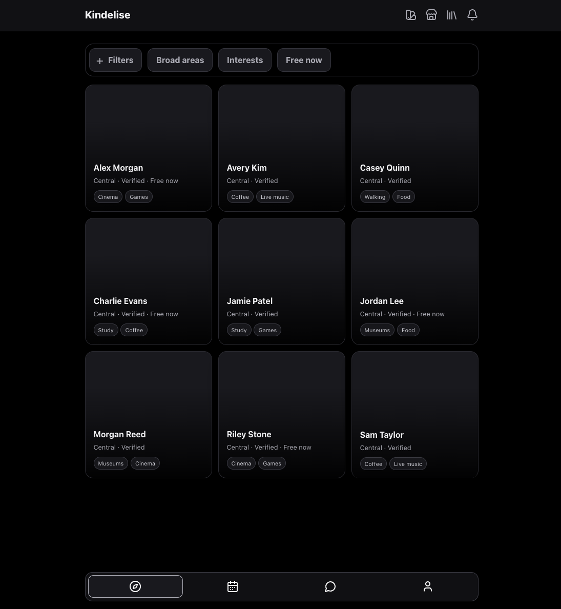
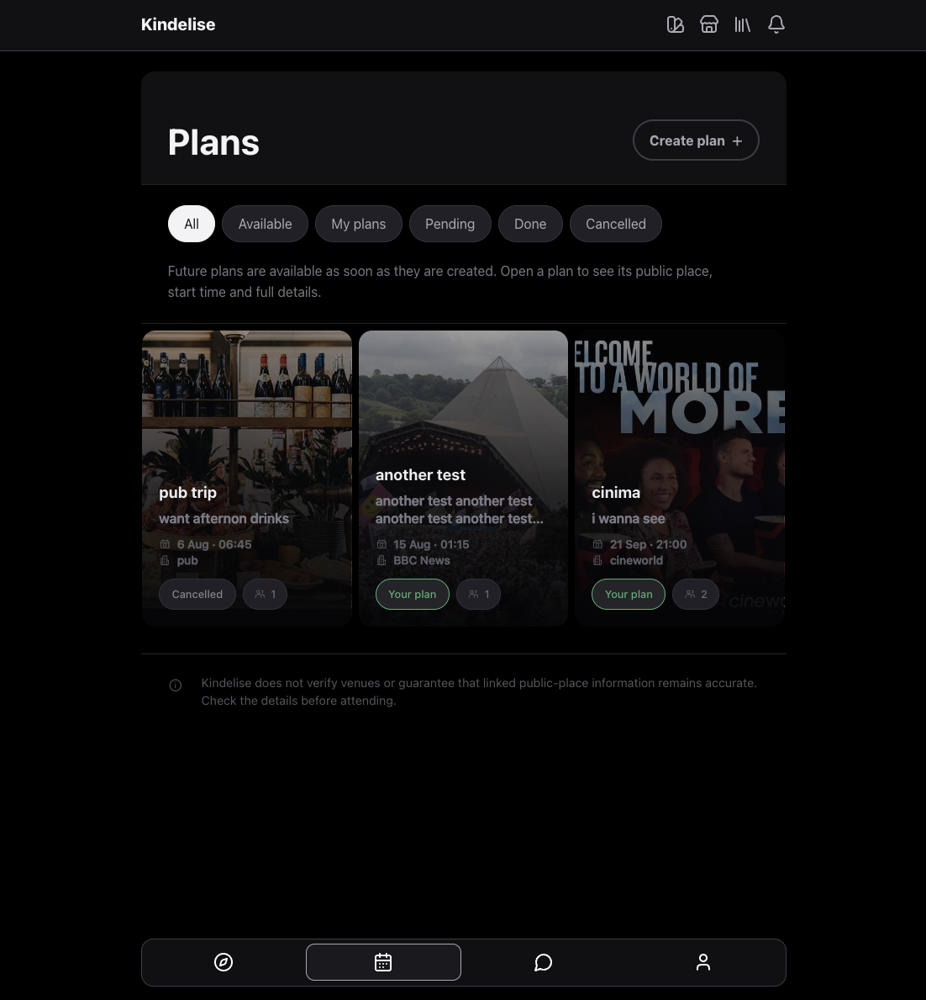
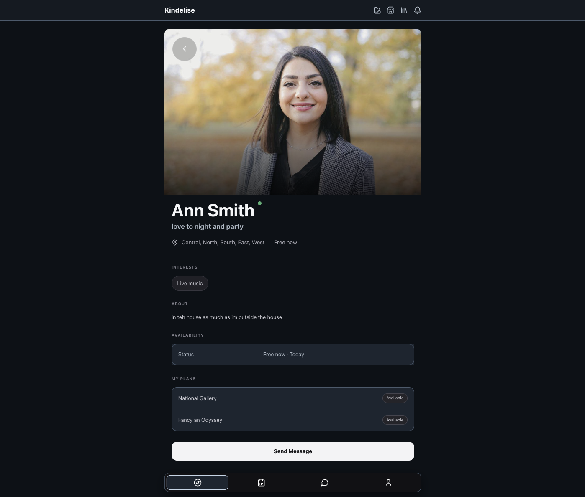

# Kindelise

[Open the live Kindelise application](https://kindelise-767f8e2065ed.herokuapp.com/discover/)

Kindelise is a server-rendered Django application for meeting people through
shared interests and arranging activities at established public places. It
includes verified profiles, broad-area discovery, public plans, direct
messages, notifications, private safety controls, Stripe Premium and an
optional Ollama writing assistant.

Kindelise is currently intended for supervised accounts. Staff verification
controls access to its social features, but it is not proof of identity, age or
safety.

Repository: [github.com/harvseale-ai/kindelise-](https://github.com/harvseale-ai/kindelise-)

## Contents

- [Main features](#main-features)
- [User stories](#user-stories)
- [Screenshots](#screenshots)
- [Technical design](#technical-design)
- [Run locally](#run-locally)
- [Environment variables](#environment-variables)
- [Staff setup](#staff-setup)
- [Stripe and Ollama](#stripe-and-ollama)
- [Testing](#testing)
- [Deployment](#deployment)
- [Security and limitations](#security-and-limitations)
- [Further development](#further-development)
- [Project documentation](#project-documentation)

## Main features

- Email and password registration using Django authentication.
- Owner-editable profiles with images, broad areas, interests and availability.
- Staff verification before discovery, plans and messaging become available.
- Profile discovery using broad-area, interest and **Free now** filters.
- Public-place plans with time, capacity, participation and image metadata.
- Safe join, leave, rejoin and owner cancellation actions.
- One private direct conversation between each permitted pair of users.
- Notifications for new messages and people joining an owned plan.
- Private blocking and reporting controls.
- Stripe-hosted yearly Premium payment and account management.
- Ollama grammar and clarity suggestions for an unsent message draft.
- Responsive, accessible pages with several optional colour themes.

The main journey is:

```text
register → complete profile → staff verification → discover people
→ create or join plans → send messages → receive notifications
```

## User stories

| # | As a user, I want to... | Main result |
| ---: | --- | --- |
| 1 | Register and sign in securely | Django password checking and a unique lowercase email. |
| 2 | Create and edit my profile | Only the owner can change profile details and availability. |
| 3 | Be verified by authorised staff | Incomplete profiles cannot receive product access. |
| 4 | Find people with shared interests | Discovery respects areas, filters and blocks. |
| 5 | Create a plan at a public place | Plans require a future time, capacity and public HTTPS evidence. |
| 6 | Join, leave or rejoin a plan | Capacity and participation history remain correct. |
| 7 | Message another eligible person | Each pair has one private plain-text conversation. |
| 8 | Block or privately report someone | Contact stops immediately while staff can receive private context. |
| 9 | Purchase optional Premium access | Stripe manages payment and Kindelise applies verified subscription events. |
| 10 | Improve an unsent message | The user compares both drafts and must still press **Send** manually. |

## Screenshots

### Discover profiles



### Browse plans



### View a public profile



## Technical design

Kindelise contains one Django project and one custom Django app:

- `config/` contains settings, the main URL map and the WSGI/ASGI startup files.
- `kindlelise/` contains the product models, forms, views and business rules.
- `templates/` contains server-rendered HTML.
- `static/` contains the shared CSS and small JavaScript enhancements.
- `tests/` contains the automated pytest suite.

One custom app is suitable because profiles, discovery, plans, messages,
notifications and safety all depend on the same users and permission rules. The
larger view and service files are still split by feature so the code remains
easy to find.

### Request flow

```text
Browser request
    → URL route
    → view
    → form and policy checks
    → selector read or service change
    → PostgreSQL model
    → HTML template response
```

| Part | Responsibility |
| --- | --- |
| Views | Handle web requests, sessions, redirects and responses. |
| Forms | Clean and validate user-controlled information. |
| Policies | Answer permission and visibility questions. |
| Selectors | Read only the database information a user may see. |
| Services | Make important database changes inside clear workflows. |
| Models | Define stored data, relationships and database constraints. |
| Templates | Render escaped, server-owned information as HTML. |

### Main data

The core models are `Profile`, `Interest`, `Plan`, `Participation`,
`Conversation`, `Message`, `Notification`, `Block`, `Report`,
`PlatformSubscription` and `StripeWebhookReceipt`. They use PostgreSQL
relationships and constraints to support the checks made in Python.

Important examples include one profile per account, one participation per
person and plan, one conversation per account pair, positive plan capacity and
unique Stripe event receipts. Plan joining also locks the current database row
before checking capacity so simultaneous joins cannot overfill a plan.

### Main technical choices

| Area | Choice and reason |
| --- | --- |
| Interface | Server-rendered Django keeps permissions and private data on the server. |
| Database | PostgreSQL supports the required constraints, arrays and row locking. |
| Discovery | Broad named areas provide useful matching without exact locations. |
| Messaging | Plain-text server-rendered messages keep the first version understandable and safe. |
| Payments | Stripe Checkout and Customer Portal prevent card details entering Kindelise. |
| AI editing | Ollama receives only the unsent draft and one fixed editing goal. |
| Images | Files are checked and re-encoded; Cloudinary provides durable hosted storage when configured. |
| Static files | WhiteNoise serves compressed versioned CSS and JavaScript on Heroku. |

Detailed file explanations and design reasoning are kept in the linked project
documents rather than repeated throughout this README.

## Run locally

### Requirements

- Python 3.12
- PostgreSQL
- Git
- A modern browser
- Stripe CLI only when testing real webhook delivery
- An Ollama API key only when testing the remote writing assistant

Node.js is not required to run the Django website. It is used only to rebuild
the optional local runtime explorer.

### 1. Install the project

```bash
git clone https://github.com/harvseale-ai/kindelise-.git
cd kindelise-

python3.12 -m venv .venv
source .venv/bin/activate
python -m pip install --upgrade pip
python -m pip install -e '.[test]'
cp .env.example .env
```

### 2. Create PostgreSQL settings

Create a PostgreSQL database and user, then place the matching values in `.env`:

```text
POSTGRES_DB=kindlelise
POSTGRES_USER=kindlelise
POSTGRES_PASSWORD=<local-password>
POSTGRES_HOST=localhost
POSTGRES_PORT=5432
```

`DATABASE_URL` takes priority when supplied and must point to PostgreSQL.

### 3. Add a Django secret

Generate a local key:

```bash
python -c "from django.core.management.utils import get_random_secret_key; print(get_random_secret_key())"
```

Copy the result into `DJANGO_SECRET_KEY` in `.env`. Replace every other
`replace_me` value for any optional feature you intend to use.

### 4. Start Django

```bash
set -a
source .env
set +a

python manage.py migrate
python manage.py check
python manage.py runserver
```

Open [http://127.0.0.1:8000/](http://127.0.0.1:8000/).

## Environment variables

Never commit `.env` or place real secrets in `.env.example`.

| Variable | When needed | Purpose |
| --- | --- | --- |
| `DJANGO_SECRET_KEY` | Always | Signs Django sessions and protected values. |
| `DJANGO_DEBUG` | Always | `true` locally and `false` when deployed. |
| `DJANGO_ALLOWED_HOSTS` | Always | Hostnames Django may serve. |
| `DJANGO_CSRF_TRUSTED_ORIGINS` | Deployment | Full HTTPS origins trusted for form submissions. |
| `DATABASE_URL` | Deployment or optional locally | Complete PostgreSQL connection URL. |
| `POSTGRES_DB`, `POSTGRES_USER`, `POSTGRES_PASSWORD`, `POSTGRES_HOST`, `POSTGRES_PORT` | Local without `DATABASE_URL` | Separate local PostgreSQL connection values. |
| `CLOUDINARY_URL` | Durable hosted images | Cloudinary account URL used for profile and plan images. |
| `STRIPE_SECRET_KEY` | Premium | Server-side Stripe key. |
| `STRIPE_WEBHOOK_SECRET` | Premium | Verifies Stripe webhook signatures. |
| `STRIPE_PRICE_ID` | Premium | Recurring yearly price identifier. |
| `OLLAMA_API_URL` | AI editing | Ollama Generate endpoint. |
| `OLLAMA_API_KEY` | Remote AI editing | Ollama Cloud bearer key. |
| `OLLAMA_MODEL` | AI editing | Pinned model name. |
| `OLLAMA_TIMEOUT_SECONDS` | AI editing | Positive request timeout. |

Production mode also enables secure cookies, HTTPS redirect, HSTS, proxy HTTPS
handling, frame denial and other Django security settings.

## Staff setup

1. Create a staff account:

   ```bash
   python manage.py createsuperuser
   ```

2. Register normal accounts through `/sign-up/` and complete their profiles.
3. Open `/admin/`, choose a profile and use the verification control.
4. Use separate normal accounts to demonstrate discovery, plans, messaging,
   notifications, blocking and reporting.

The seeded interests are Coffee, Walking, Museums, Live music, Cinema, Food,
Games and Study.

## Stripe and Ollama

### Stripe test mode

Kindelise expects one recurring GBP £4.99 yearly price. Add the test secret key
and Price ID to `.env`, start Django and run:

```bash
stripe login
stripe listen --forward-to 127.0.0.1:8000/stripe/webhook/
```

Copy the displayed `whsec_...` value into `STRIPE_WEBHOOK_SECRET`, then restart
Django. Checkout and subscription management take place on Stripe's hosted
pages. Premium access is changed only by a correctly signed webhook, never by
the browser returning from Checkout.

### Ollama writing assistant

The example configuration is:

```text
OLLAMA_API_URL=https://ollama.com/api/generate
OLLAMA_API_KEY=<revocable-api-key>
OLLAMA_MODEL=gpt-oss:20b
OLLAMA_TIMEOUT_SECONDS=10
```

After restarting Django, open a permitted conversation and expand **Edit this
unsent draft**. **Fix grammar** preserves the original structure, while
**Improve clarity** may reorganise it. The user must choose **Use suggestion**
and then press **Send**; Ollama cannot send a message itself.

## Testing

Load `.env`, then run the normal checks:

```bash
set -a
source .env
set +a

python manage.py check
python manage.py makemigrations --check --dry-run
pytest -q
python manage.py collectstatic --dry-run --noinput --verbosity 0
python -m pip check
```

Additional quality and security checks:

```bash
ruff check config kindlelise tests
bandit -q -r config kindlelise -x kindlelise/migrations
coverage erase
coverage run -m pytest -q
coverage report
pip-audit --local --skip-editable
```

### Recorded results

| Check | Result |
| --- | --- |
| Django system and deployment checks | Passed with 0 issues |
| Migration drift check | Passed |
| PostgreSQL pytest suite | **120 tests passed** |
| Branch-aware Coverage.py report | **83%**, above the configured 80% minimum |
| Ruff | Passed |
| Bandit | Passed with no unsuppressed findings |
| pip-audit | No known vulnerabilities found in installed dependencies |
| Static collection and dependency consistency | Passed |
| W3C CSS Validator | **Pass** |
| HTML Checker | **Pass** |
| Lighthouse | Performance **94**, Accessibility **100**, Best Practices **100**, SEO **90** |

[View screenshots of the HTML, CSS and Lighthouse results](https://docs.google.com/document/d/1JyWivhJncSulWrqepOKu2DkVEdx2hoze0tvE9_bE7eY/edit?tab=t.0).

The automated suite covers authentication, profile ownership, staff
verification, discovery limits, images, plan capacity, participation,
messaging, notifications, blocks, reports, Stripe events, Ollama boundaries,
CSRF, privacy responses and stable database-query counts. External provider
calls use controlled replacements during automated tests.

Manual browser results are recorded in
[`docs/MANUAL_TESTING.md`](docs/MANUAL_TESTING.md).

## Deployment

The repository contains the files Heroku needs:

- `requirements.txt` for production Python packages.
- `.python-version` for Python 3.12.
- `Procfile` for database migrations and Gunicorn.
- WhiteNoise configuration for collected static files.
- PostgreSQL `DATABASE_URL` support.
- Cloudinary storage when `CLOUDINARY_URL` is configured.

Required Heroku Config Vars are:

```text
DJANGO_SECRET_KEY=<unique-production-secret>
DJANGO_DEBUG=false
DJANGO_ALLOWED_HOSTS=<deployed-hostname>
DJANGO_CSRF_TRUSTED_ORIGINS=https://<deployed-hostname>
DATABASE_URL=<managed-postgresql-url>
CLOUDINARY_URL=<cloudinary-account-url>
STRIPE_SECRET_KEY=<matching-environment-key>
STRIPE_WEBHOOK_SECRET=<deployed-endpoint-secret>
STRIPE_PRICE_ID=<matching-environment-price>
OLLAMA_API_URL=https://ollama.com/api/generate
OLLAMA_API_KEY=<revocable-key>
OLLAMA_MODEL=<pinned-model>
```

The release process runs migrations and the web process starts Gunicorn:

```text
release: python manage.py migrate --noinput
web: gunicorn config.wsgi --log-file - --access-logfile -
```

Before deployment, run `python manage.py check --deploy` with production-style
settings. After deployment, check the main pages, Admin, uploaded images,
Stripe test mode, Ollama and application logs.

## Security and limitations

### Main protections

- Django hashes passwords and provides session, CSRF and template-escaping
  protection.
- State-changing actions use POST and server-owned user identities.
- Policies fail closed for inactive, incomplete, unverified or blocked users.
- Database constraints and transactions support the Python checks.
- Uploaded images are checked, resized and stripped of embedded metadata.
- Public-place fetching permits bounded public HTTPS resources only.
- Stripe signatures, unique receipts and event ordering protect Premium state.
- Ollama receives no profile details, earlier messages or automatic-send power.
- Secrets remain in environment variables and `.env` is ignored by Git.

### Current limitations

- Staff verification is an access gate, not an identity or safety guarantee.
- Broad areas intentionally replace exact location and distance tracking.
- Public-place metadata can become outdated and must be checked by the user.
- Messaging uses page refreshes rather than live sockets or read receipts.
- Reports support staff review but are not an emergency-response service.
- Premium currently has one yearly product.
- Provider-backed features depend on Stripe, Ollama and Cloudinary availability.
- There is no background worker, production monitoring or automated payment
  reconciliation process.

## Further development

The main planned feature is owner-approved plan membership. Instead of joining
immediately, a user would send a request and the owner would accept or decline
it. Capacity would change only after approval, and both people would receive a
notification when the request changes state.

## Project documentation

- [`docs/DJANGO_REVISION_GUIDE.md`](docs/DJANGO_REVISION_GUIDE.md) — concise
  presentation revision guide explaining the Django files and design.
- [`docs/DECISIONS.md`](docs/DECISIONS.md) — important technical decisions and
  their reasons.
- [`docs/MANUAL_TESTING.md`](docs/MANUAL_TESTING.md) — browser tests, findings
  and outcomes.
- [`docs/RUNTIME.md`](docs/RUNTIME.md) — source for the application flowcharts.
- [`runtime-explorer.html`](runtime-explorer.html) — clickable local flowchart
  explorer generated from `docs/RUNTIME.md`.

Rebuild or check the explorer with:

```bash
node tools/build-runtime-explorer.mjs
node tools/build-runtime-explorer.mjs --check
```

## AI assistance

AI tools supported code review, debugging, test ideas, accessibility checks and
documentation structure. Changes were reviewed in the repository and checked
with the commands recorded above. Ollama is also a deliberately limited product
feature: it can suggest wording for one unsent draft but cannot read previous
messages, send content, verify users, approve plans or grant Premium.
