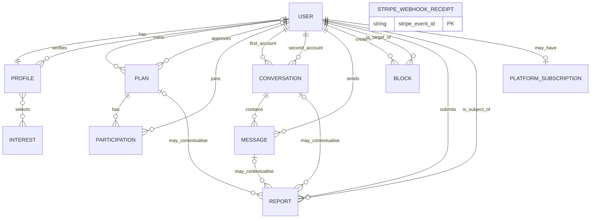

# Kindlelise Data Model and ERD

Student MVP data model aligned with the Kindlelise 36-File Vertical Slice.

## 1. Purpose, status and authority

This document explains the smallest durable data model needed for the assessed Kindlelise journey:

```text
register or sign in
→ create and manually verify a profile
→ discover profiles in broad named areas
→ create and manually approve a public-place plan
→ join or leave the plan
→ exchange direct messages
→ block or privately report another account
→ optionally receive Premium access from verified Stripe events
```

Ollama Cloud may suggest an edit to one unsent message draft, but it creates no durable AI data.

[`docs/VERTICAL_SLICE.md`](VERTICAL_SLICE.md) is the authoritative implementation contract. This document cannot add models, fields, states, constraints, functions or features that are absent from that contract. If the documents disagree, the vertical slice wins.

Implementation status: designed, not yet confirmed by generated migrations. Before views or templates are treated as stable, the models, constraints and indexes must be verified in a PostgreSQL migration.

## 2. Modelling rules

1. Use Django's existing `User`; do not create a replacement account model.
2. Put all ten Kindlelise model classes in `kindlelise/models.py`.
3. Use Django's normal unique username and password authentication and normal
   primary-key type. Email is not an MVP authentication identifier, and the
   student MVP does not require a custom UUID scheme.
4. Store all datetimes as timezone-aware values through Django and PostgreSQL.
5. Store only stable broad-area keys configured in `settings.py`; never store
   arbitrary area text, browser coordinates, exact distance or location history.
6. Store availability once as `Profile.available_until`; do not create a presence model.
7. Store plain-text messages and escape them when rendering; never mark user text as safe HTML.
8. Keep verification and plan approval as fields on their owning records; do not create provider, evidence or decision-history models.
9. Preserve plan and participation history through states rather than routine hard deletion.
10. Derive current availability, plan capacity, Premium access and other presentation facts instead of storing duplicate booleans or counters.
11. Let database constraints protect facts that can be expressed within one table. Enforce cross-table permissions and reference relevance in named policies and services.
12. Stripe webhooks project limited subscription state only. Stripe owns payment data.
13. Ollama receives an unsent draft transiently and owns no database table.
14. A record proves that Kindlelise stored a statement or decision; it does not prove that a person, URL, venue or report is true.

## 3. Model inventory

The MVP uses Django's built-in `User` plus exactly ten Kindlelise models.

| Durable entity | Purpose |
| --- | --- |
| Django `User` | Credentials, password hashing, active state, authentication and staff status. |
| `Profile` | Public profile information, broad area, availability, interests and manual verification state. |
| `Interest` | One controlled discovery interest from the small staff-seeded vocabulary. |
| `Plan` | One proposed public-place activity, its manual approval state and its first-join lock. |
| `Participation` | One account's current or ended participation in one plan. |
| `Conversation` | The one direct conversation permitted for an unordered pair of accounts. |
| `Message` | One bounded plain-text message sent inside a direct conversation. |
| `Block` | One directional block; policy applies it as a two-way interaction exclusion. |
| `Report` | One private user statement about another account with at most one optional context reference. |
| `PlatformSubscription` | The minimal local projection of one account's Stripe subscription. |
| `StripeWebhookReceipt` | One verified Stripe event identifier and its processing time. |

`Profile.interests` uses Django's automatic many-to-many join table. That mechanical table is not a separate Kindlelise model because the relationship has no extra behaviour.

## 4. Relationship ERD



`StripeWebhookReceipt` is not linked by a foreign key to `PlatformSubscription`. It records the unique provider event and is processed atomically with the appropriate subscription projection.

### Cardinality summary

| Parent | Relationship | Child | Rule |
| --- | --- | --- | --- |
| `User` | 1:1 | `Profile` | Every registered Kindlelise account receives one profile. |
| `Profile` | M:M | `Interest` | Django owns the automatic join table. |
| `User` | 1:M | `Plan` | One verified user may own several plans. |
| `Plan` | 1:M | `Participation` | One row per user and plan, reused for an eligible rejoin. |
| `User` pair | one per pair | `Conversation` | Lower user ID is always stored first. |
| `Conversation` | 1:M | `Message` | Messages remain plain text and ordered by `sent_at`. |
| `User` | 1:M | `Block` | The stored direction records who initiated the block. |
| `User` | 1:M | `Report` | Reporter and subject are different accounts. |
| `Report` | 0..1 total | Plan, conversation or message | At most one of the three optional references is supplied. |
| `User` | 0..1 | `PlatformSubscription` | No subscription row is needed before billing begins. |

## 5. Entity definitions

Field types below describe the intended Django/PostgreSQL shape. The exact bounds
in `docs/VERTICAL_SLICE.md` are implemented once in `models.py` and reused by
forms; views do not invent different limits.

### 5.1 Django `User`

Django's built-in user model owns:

- username and the minimum registration fields;
- password hashing and password validation;
- `is_active` for account eligibility;
- session authentication;
- `is_staff` and permissions for Django Admin.

Kindlelise does not add email-based authentication, date of birth, age, payment
state, verification-provider data or exact location to `User`. Manual profile
verification is the MVP eligibility gate. Stripe is not an age-verification
service. The assessment uses supervised test accounts only and must not be
presented as ready for unrestricted public use.

### 5.2 `Profile`

| Field | Intended type | Required | Purpose |
| --- | --- | ---: | --- |
| `user` | `OneToOneField(User)` | Yes | One profile for one Django account. |
| `display_name` | bounded `CharField(blank=True, default="")` | Before verification | Public name shown in discovery and conversations. |
| `biography` | bounded `TextField` | No | Short public introduction. |
| `broad_area` | bounded `CharField(blank=True, default="")` | Before verification | Stable configured area key whose label is shown as the named discovery district. |
| `interests` | `ManyToManyField(Interest)` | No | Controlled interests selected by the profile owner. |
| `available_until` | nullable `DateTimeField` | No | Expiring “available now” statement. |
| `is_verified` | `BooleanField` | Yes | Staff-controlled eligibility state; default false. |
| `verified_at` | nullable `DateTimeField` | No | Time of the current manual verification. |
| `verified_by` | nullable `ForeignKey(User)` | No | Staff account that recorded the current verification. |

Registration must be able to create the one-to-one profile before the user has
completed it. The initial unverified row therefore stores empty strings for
`display_name` and `broad_area`; these are deliberate onboarding values, not
valid completed-profile values. `ProfileDetailsForm` requires a non-empty display
name and a stable key from `KINDLELISE_AREAS`, and the staff verification action
refuses the profile until both values are valid. Once the profile is complete,
the two fields are required and ordinary profile edits cannot clear them.

Derived, not stored:

- `Profile.is_available_now(at_time)` is true only when `available_until` is later than the supplied time;
- age, distance, coordinates and online status do not exist in this slice;
- discovery visibility is a policy result, not a profile boolean.

Browser profile forms may update only display name, biography, a configured stable
area key, availability and interests. They reject arbitrary area text and must
never bind `is_verified`, `verified_at` or `verified_by`.

Verification fields must remain consistent:

```text
is_verified = true  → verified_at and verified_by are present
is_verified = false → verified_at and verified_by are null
```

Removing verification clears both review fields. `is_verified` defaults to false.

### 5.3 `Interest`

| Field | Intended type | Required | Purpose |
| --- | --- | ---: | --- |
| `name` | unique bounded `CharField` | Yes | Human-readable item in the small controlled vocabulary. |

The unique name is the complete MVP identity for an interest. The slice does not
need a slug, categories, aliases, custom labels, moderation levels or retirement
workflows.

A reviewed initial data migration seeds Coffee, Walking, Museums, Live music,
Cinema, Food, Games and Study. Staff may maintain that vocabulary through Django
Admin. Ordinary users select existing interests and cannot create free-text tags.

### 5.4 `Plan`

| Field | Intended type | Required | Purpose |
| --- | --- | ---: | --- |
| `owner` | `ForeignKey(User)` | Yes | Verified account that created the plan. |
| `title` | bounded `CharField` | Yes | Short activity title. |
| `description` | bounded `TextField` | Yes | Plain-language plan description. |
| `public_place` | bounded `CharField` | Yes | Independently established public venue or activity. |
| `public_url` | `URLField` | Yes | Normal HTTPS evidence URL manually reviewed by staff. |
| `starts_at` | `DateTimeField` | Yes | Future meeting time. |
| `capacity` | positive integer | Yes | Maximum joined participants; must be greater than zero. |
| `status` | constrained choice | Yes | `pending`, `approved`, `rejected` or `cancelled`; defaults to `pending`. |
| `approved_at` | nullable `DateTimeField` | No | Time of current approval. |
| `approved_by` | nullable `ForeignKey(User)` | No | Staff account that approved the plan. |
| `meeting_details_locked_at` | nullable `DateTimeField` | No | Set by the first successful join in the join transaction. |
| `created_at` | `DateTimeField` | Yes | Creation time and stable ordering aid. |

Derived, not stored:

- current joined count is the count of related `Participation` rows in `joined` state;
- spare capacity is `capacity` minus that current count;
- a plan is past when `starts_at <=` the current time; `past` is derived and is never stored as another status;
- `Plan.is_open_for_joining(at_time)` checks approval, future time, cancellation and capacity without changing data.

`capacity` is the number of participant places and does not include the owner, because owners never receive a participation row.

Approval fields must remain consistent:

```text
status = approved     → approved_at and approved_by are present
status != approved    → approved_at and approved_by are null
```

Returning an edited approved plan to `pending` clears the old approval fields. A
rejected unlocked plan may be edited, and saving it resubmits it as `pending`.
Cancelled plans are terminal and cannot be edited, approved or reactivated.
Approval history is not stored in this student slice.

The submitted URL is evidence for manual review, not automatic authority. A dropped map pin, residential address, payment link or personal social-media post cannot be approved as primary evidence. Kindlelise stores no fetched page, redirect chain, URL validation, substantiation or meet-artifact record.

### 5.5 `Participation`

| Field | Intended type | Required | Purpose |
| --- | --- | ---: | --- |
| `plan` | `ForeignKey(Plan)` | Yes | Plan being joined. |
| `user` | `ForeignKey(User)` | Yes | Participant; cannot be the plan owner by application policy. |
| `status` | constrained choice | Yes | `joined` or `left`; new participation defaults to `joined`. |
| `joined_at` | `DateTimeField` | Yes | Most recent successful join time. |
| `left_at` | nullable `DateTimeField` | No | Departure time; null while joined. |

There is one row per `(plan, user)`. Leaving changes the row to `left`; it does not delete it. An eligible rejoin changes the same row to `joined`, replaces `joined_at` with the newest successful join time and clears `left_at`.

Participation fields must remain consistent:

```text
status = joined → left_at is null
status = left   → left_at is present
```

The first successful join sets the plan's `meeting_details_locked_at` in the same transaction. Participation contains no offer, invitation, accepted artifact, check-in, attendance or no-show fields.

### 5.6 `Conversation`

| Field | Intended type | Required | Purpose |
| --- | --- | ---: | --- |
| `first_user` | `ForeignKey(User)` | Yes | Lower account ID in the pair. |
| `second_user` | `ForeignKey(User)` | Yes | Higher account ID in the pair. |
| `updated_at` | `DateTimeField` | Yes | Latest successful message activity for inbox ordering. |

Users think of a conversation as an unordered pair. The database always stores the lower user ID first so the same pair cannot be created twice. There is no participant join model because every MVP conversation contains exactly two accounts.

`Conversation.includes_account(user)` returns whether the supplied account is exactly either member and does not mutate state.

Two simultaneous attempts may race to create the pair. The unique database constraint remains authoritative: try to create the ordered pair, catch `IntegrityError`, retrieve the existing row and return it.

### 5.7 `Message`

| Field | Intended type | Required | Purpose |
| --- | --- | ---: | --- |
| `conversation` | `ForeignKey(Conversation)` | Yes | Direct conversation containing the message. |
| `sender` | `ForeignKey(User)` | Yes | One of the two conversation members. |
| `body` | bounded `TextField` | Yes | Non-empty plain-text message. |
| `sent_at` | `DateTimeField` | Yes | Send time and chronological ordering key. |

A simple database constraint cannot check that `sender` is one of the two users in the linked conversation, so `send_direct_message()` checks membership, active verification and mutual-block rules before saving.

There are no attachments, edits, reactions, read receipts, delivery receipts, system-message types or AI-origin fields. Ollama suggestions are not messages until the user accepts, revalidates and manually sends the resulting draft.

### 5.8 `Block`

| Field | Intended type | Required | Purpose |
| --- | --- | ---: | --- |
| `blocker` | `ForeignKey(User)` | Yes | Account that initiated the block. |
| `blocked_user` | `ForeignKey(User)` | Yes | Different account targeted by the block. |

One directional row is enough. Policies treat a block in either direction as exclusion from discovery and direct messaging. The two account IDs must differ, and `(blocker, blocked_user)` is unique.

The current slice maps block creation but no unblock workflow or route. Do not add a revocation field or removal function without approval. A block does not prevent a private report.

### 5.9 `Report`

| Field | Intended type | Required | Purpose |
| --- | --- | ---: | --- |
| `reporter` | `ForeignKey(User)` | Yes | Account submitting the private statement. |
| `reported_user` | `ForeignKey(User)` | Yes | Different account that is the report subject. |
| `category` | constrained choice | Yes | Small approved reason vocabulary. |
| `description` | bounded `TextField` | Yes | Private factual description supplied by the reporter. |
| `reported_plan` | nullable `ForeignKey(Plan)` | No | Optional relevant plan context. |
| `reported_conversation` | nullable `ForeignKey(Conversation)` | No | Optional relevant conversation context. |
| `reported_message` | nullable `ForeignKey(Message)` | No | Optional relevant message context. |
| `status` | constrained choice | Yes | `received` or `reviewed`; defaults to `received`. |
| `received_at` | `DateTimeField` | Yes | Submission time and staff ordering key. |

At most one optional reference may be present. The service validates relevance because it crosses tables:

- a referenced plan is valid only when both the reporter and reported account are
  connected to it as owner or participant;
- a referenced conversation must contain both accounts;
- a referenced message must belong to that two-account conversation and have been visible to the reporter.

The reporter sees submission and confirmation only; authorised staff may inspect
the durable report. The reported account and unrelated ordinary users cannot see
it. It is a private statement, not a finding, sanction, public warning or
searchable accusation.

### 5.10 `PlatformSubscription`

| Field | Intended type | Required | Purpose |
| --- | --- | ---: | --- |
| `user` | `OneToOneField(User)` | Yes | Local account receiving the Stripe projection. |
| `stripe_customer_id` | nullable unique `CharField` | No | Stripe customer ownership link. |
| `stripe_subscription_id` | nullable unique `CharField` | No | Stripe subscription ownership link. |
| `stripe_status` | nullable bounded provider-state field | No | Latest accepted subscription status; remains null until a subscription event supplies it. |
| `access_until` | nullable `DateTimeField` | No | Latest accepted billing-period end. |
| `latest_provider_event_at` | nullable `DateTimeField` | No | Orders accepted subscription-state events; Checkout completion does not advance it. |
| `updated_at` | `DateTimeField` | Yes | Local projection update time. |

`PlatformSubscription.has_premium_access()` returns true only when:

```text
stripe_status is active or trialing
AND access_until is later than the current time
```

Checkout creation, browser return and `checkout.session.completed` never grant
Premium. That event records trusted identifiers only and does not advance
`latest_provider_event_at`. A newer `customer.subscription.updated` may grant
access. `customer.subscription.deleted` sets `stripe_status` to `cancelled`,
clears `access_until` and updates `latest_provider_event_at`.

Provider timestamps can tie. For equal-time subscription-state events, deletion
has fail-closed precedence and may revoke access; an equal-time non-deletion event
cannot overwrite an already accepted state. A safely refused supported event is
still recorded as processed so Stripe does not retry it forever. Older events
never change the projection.

Subscription deletion retains `stripe_customer_id` and `stripe_subscription_id`. Keeping those identifiers allows safe matching of later provider events and continued access to Stripe's customer portal; it does not retain payment-card data or Premium access.

Email is never subscription ownership proof. Ownership comes from the immutable local user ID in Stripe `client_reference_id`, `kindlelise_user_id` subscription metadata or an existing unique Stripe-ID link. An identifier already linked to another account is rejected rather than reassigned.

### 5.11 `StripeWebhookReceipt`

| Field | Intended type | Required | Purpose |
| --- | --- | ---: | --- |
| `stripe_event_id` | unique bounded `CharField` | Yes | Makes verified provider-event processing idempotent. |
| `event_type` | bounded `CharField` | Yes | One of the three supported event types. |
| `provider_created_at` | `DateTimeField` | Yes | Provider ordering time. |
| `processed_at` | nullable `DateTimeField` | No | Set only after subscription processing succeeds. |

Supported types are exactly:

- `checkout.session.completed`;
- `customer.subscription.updated`;
- `customer.subscription.deleted`.

Receipt and subscription changes share one short transaction: lock or create the nullable receipt, stop a processed duplicate, compare provider time, validate ownership, apply permitted projection changes and then set `processed_at`. If any step fails, the transaction rolls back both the subscription change and the new receipt, so no failed unprocessed receipt remains committed. Nullability is needed only while that atomic workflow is in progress; it is not a retry queue or processing-state design.

An unsupported event is signature-checked and acknowledged by the webhook view,
but it is not stored in `StripeWebhookReceipt` and cannot change a subscription.
The view returns `400` for invalid signature or malformed signed JSON, `200` for
unsupported, duplicate, stale, safely refused equal-time or successful events,
and `500` when supported processing rolls back and Stripe should retry. No Stripe
network request occurs inside the database transaction. Raw webhook payloads,
card data and bank data are not stored.

## 6. Database constraints

The initial migration must contain these constraints:

| Entity | Database-enforced rule |
| --- | --- |
| `Profile` | One profile per user; verified state requires both review fields and unverified state requires both to be null. |
| `Interest` | Unique name. |
| `Plan` | `capacity > 0`; approved state requires both approval fields and every other state requires both to be null. |
| `Participation` | Unique `(plan, user)`; `joined` requires null `left_at` and `left` requires populated `left_at`. |
| `Conversation` | `first_user != second_user`, `first_user_id < second_user_id`, and unique `(first_user, second_user)`. |
| `Block` | `blocker != blocked_user` and unique `(blocker, blocked_user)`. |
| `Report` | `reporter != reported_user` and at most one optional context foreign key is populated. |
| `PlatformSubscription` | One row per user; Stripe customer and subscription IDs unique when non-null. |
| `StripeWebhookReceipt` | `stripe_event_id` unique. |

Do not rely on forms alone for these rules. Conversely, do not attempt fragile database checks that must traverse other tables; those remain explicit application invariants.

## 7. Required indexes

The vertical slice permits only indexes serving its mapped reads:

```text
Profile(is_verified, broad_area)
Plan(status, starts_at)
Participation(plan, status)
Participation(user, status)
Conversation(first_user, updated_at)
Conversation(second_user, updated_at)
Message(conversation, sent_at)
Report(status, received_at)
```

Unique constraints create their normal supporting indexes. Do not add speculative indexes for future analytics, exact location, moderation or provider searching.

## 8. Application-enforced invariants

These rules require policies, selectors or services because they depend on several rows, current time or the authenticated actor.

### Accounts and discovery

- Social features require an authenticated, active user with a manually verified profile.
- Staff verification requires a completed profile with a non-empty display name
  and a broad-area key currently present in `KINDLELISE_AREAS`.
- Discovery uses permitted broad named areas and the approved free or Premium interest limit.
- Discovery excludes the viewer and a block in either direction.
- “Available now” includes only profiles whose `available_until` remains in the future.
- Premium changes area and filter limits only; it never overrides verification, blocking or visibility rules.

### Plans and participation

- Only active verified accounts may create plans.
- A browser-created plan is always `pending` regardless of submitted status data.
- Only approved future uncancelled plans appear publicly and accept joins.
- Staff may approve only a pending future unlocked plan after manually checking its URL and public place.
- Staff approval records reviewer and time but does not prove venue safety or preserve the external page.
- A plan owner cannot join their own plan.
- Joining locks the plan row with `select_for_update()`, recounts joined participation and rechecks capacity.
- The first successful join sets `meeting_details_locked_at` in the same transaction.
- After the first join, the entire plan is read-only except cancellation.
- Before the first join, changing an approved plan's public place, public URL or start time returns it to `pending` review.
- Before the first join, saving changes to a rejected plan resubmits it as
  `pending` review.
- A cancelled plan is terminal and cannot be edited, approved or reactivated.
- Leaving changes current participation to `left` without deleting it.
- Rejoining reuses a left row only while the plan remains approved, future, uncancelled and below capacity.
- Cancellation removes the plan from discovery and future joining, clears the
  current approval fields to satisfy status consistency, and does not delete
  participation history.

### Messaging, blocking and reports

- Starting or continuing a direct conversation requires two different active verified accounts and no block in either direction.
- Opening a conversation requires membership and the same mutual-block check.
- A message sender must be one of the conversation's two accounts.
- A successful send updates `Conversation.updated_at`.
- A block in either direction removes discovery and direct-message access immediately.
- A user may still submit a private report when blocking prevents other interaction.
- Report context accepts at most one server-validated plan, conversation or message reference.
- Reports remain hidden from the reported account and ordinary users other than the reporter.

### Stripe and Ollama

- Stripe signatures are checked against the exact raw request body before trusted event parsing.
- Only the three supported event types reach the subscription update service.
- A signature-valid unsupported event is acknowledged without a receipt row or subscription change.
- Duplicate and older events cannot overwrite an already accepted newer projection.
- A committed receipt always has `processed_at`; a processing failure rolls back the new receipt and subscription change together.
- Premium requires both an allowed status and future `access_until`.
- Subscription deletion clears status-based access but retains the stored Stripe identifiers.
- Ollama editing requires current conversation membership, active verification and no block in either direction.
- Only the unsent draft and fixed editing goal are sent to Ollama.
- Invalid output or provider failure leaves the original draft unchanged.
- Ollama never stores or sends a message.

## 9. State transitions

### Profile verification

```text
registered with empty profile fields
→ user completes display name and broad area → unverified complete profile
→ staff verifies → verified
→ staff removes verification → unverified
```

Staff cannot verify the initial incomplete profile. Removing verification denies
discovery, plans and messaging without deleting the completed profile or existing
product records.

### Plan

```text
create → pending
pending → staff approves → approved
pending → staff rejects → rejected
approved + relevant pre-join edit → pending
rejected + valid pre-join edit → pending
eligible owned plan → owner cancels → cancelled
```

The first join does not create another plan status. It sets
`meeting_details_locked_at`, after which editing is refused. `cancelled` is a
terminal state.

### Participation

```text
no row → successful join → joined
joined → leave → left
left → eligible rejoin → joined
```

### Report

```text
received → authorised staff reviews → reviewed
```

The transition is handling state only, not a judgment of truth.

### Stripe projection

```text
checkout.session.completed
→ record trusted Stripe identifiers only

newer customer.subscription.updated
→ record provider status and billing-period end
→ Premium is derived only when status and time both qualify

customer.subscription.deleted
→ stripe_status = cancelled
→ access_until = null
→ latest_provider_event_at = deletion event time
```

## 10. Transaction and concurrency boundaries

Only short database work belongs in transactions.

| Workflow | Required boundary |
| --- | --- |
| Registration | Create Django `User` and `Profile` atomically. |
| Plan joining | Lock plan, recount capacity, create/reactivate participation and set first-join lock atomically. |
| Conversation creation | Canonically order IDs; database uniqueness wins races; retrieve existing row after `IntegrityError`. |
| Message send | Recheck membership/block rules, insert message and update conversation time consistently. |
| Stripe projection | Claim receipt and update subscription in one short transaction after signature verification. |

Stripe Checkout/portal calls and Ollama requests occur outside database transactions. No remote URL fetch exists.

## 11. Query projections

Selectors return only data needed by the mapped page.

| Projection | Durable inputs | Required exclusions |
| --- | --- | --- |
| Discovery grid | `Profile`, interests, current subscription projection | Self, inactive/unverified accounts, disallowed areas, either-direction blocks, expired availability when filter selected. |
| Plan list | `Plan`, participation state | Other owners' pending/rejected/cancelled plans; past or unapproved public plans. |
| Plan page | `Plan`, joined count, viewer participation | Any plan the viewer is not authorised to see. |
| Inbox | `Conversation`, other profile, `updated_at` | Conversations blocked in either direction. |
| Conversation page | `Conversation`, chronological `Message` rows | Non-members and either-direction blocks. |
| Private report form | Target `Profile`; at most one optional `Plan`, `Conversation` or `Message` | Missing/self targets and irrelevant optional context; target resolution deliberately does not apply interaction blocks. |
| Account summary | Own profile, own plans, own subscription | Reports and raw Stripe webhook data. |

Selectors never mutate records, repair state, call Stripe or call Ollama.

## 12. Privacy classification

| Data | Classification | Exposure |
| --- | --- | --- |
| Display name, biography and selected interests | Public within authorised product pages | Eligible profiles only. |
| Broad area | Coarse public product data | Eligible discovery/profile views; never coordinates. |
| `available_until` | Time-limited profile signal | May produce “available now”; exact expiry need not be displayed. |
| Verification fields | Restricted staff/account state | Public UI may show a simple state, not reviewer identity. |
| Plan fields and joined count | Product-visible | Only under plan visibility rules. |
| Participation | Relationship data | The user's own participation; plan pages derive only the current joined count required by the slice. |
| Message body | Private communication | Conversation members and authorised staff access where lawfully required. |
| Block | Private safety preference | Blocker and authorised enforcement paths; never notify target. |
| Report description and context | Highly restricted safety data | Reporter and authorised staff; never the reported account. |
| Stripe IDs and access state | Restricted billing metadata | Account controls and authorised server/staff paths only. |
| Webhook receipt | Restricted operational metadata | Server and authorised staff only. |
| Ollama draft and suggestion | Transient provider data | Current requesting user; not stored by Kindlelise. |

Logs must omit message bodies, report descriptions, raw Stripe payloads and Ollama drafts.

## 13. Delete and history rules

### Intended foreign-key deletion behaviour

These choices prevent Django's migration generator from deciding historical behaviour accidentally:

| Relationship | `on_delete` | Reason |
| --- | --- | --- |
| `Profile.user` | `CASCADE` | A profile has no meaning without its authentication account. Other protected history may still prevent account deletion. |
| `Profile.verified_by` | `PROTECT` | A referenced reviewer is retained so verified-state consistency cannot be broken; staff accounts are deactivated rather than deleted. |
| `Plan.owner` | `PROTECT` | A plan and its participation history must not disappear with its owner. |
| `Plan.approved_by` | `PROTECT` | A referenced reviewer is retained so approved-state consistency cannot be broken; staff accounts are deactivated rather than deleted. |
| `Participation.plan` | `PROTECT` | Participation history protects its plan. |
| `Participation.user` | `PROTECT` | Participation history must not be silently orphaned. |
| `Conversation.first_user` and `second_user` | `PROTECT` | Direct-message history protects both account references. |
| `Message.conversation` and `sender` | `PROTECT` | A sent message must retain its conversation and sender relationship. |
| `Block.blocker` and `blocked_user` | `CASCADE` | A block has no independent meaning after either referenced account is actually deleted. |
| `Report.reporter` and `reported_user` | `PROTECT` | A private safety statement must not disappear through routine account deletion. |
| Optional report context references | `PROTECT` | Referenced plan, conversation or message context must remain inspectable. |
| `PlatformSubscription.user` | `PROTECT` | Billing ownership must be resolved before account deletion. |

`StripeWebhookReceipt` has no foreign key. Interest join rows use Django's normal automatic many-to-many cleanup.

- Do not delete a participation row when a user leaves.
- Do not delete a plan or its participation history when the owner cancels.
- Do not rewrite sent messages through the AI editing feature.
- Do not delete and recreate a conversation to work around pair uniqueness.
- Do not delete a processed Stripe receipt to replay an event.
- Do not expose or delete reports through ordinary reported-user actions.
- Use Django's explicit `on_delete` choices and review them in the generated migration so account deletion cannot accidentally erase retained relationship or safety records without a documented policy.

This slice does not design a full retention, erasure or legal-hold system. Those operational policies remain future work and must not be simulated with extra MVP models.

## 14. Explicitly absent entities

The following old or production-scale entities are not part of this ERD:

- custom account, profile-photo or verification-history models;
- presence, current-location, coordinate or distance tables;
- interest categories, aliases or custom-interest models;
- plan URL, URL validation, substantiation or anchor-decision models;
- venue catalogues, meet artifacts, plan versions, requirements or acknowledgements;
- participation offers, invitations or attendance records;
- group conversations, participant join tables, attachments or read receipts;
- check-ins, trusted contacts, safety experiences or blind-corroboration records;
- report-evidence, moderation case, finding, sanction or appeal models;
- notification, delivery, audit-event or analytics models;
- invoice, payment-method, multiple-tier or billing-ledger models;
- AI prompt, suggestion, conversation-memory or moderation models.

Future production work does not reserve tables, fields or placeholder migrations in the student MVP.

## 15. Migration acceptance checklist

Before building views or templates, confirm:

- [ ] PostgreSQL successfully migrates Django `User` support and all ten Kindlelise models.
- [ ] A fresh database receives the eight fixed interests from the reviewed data migration.
- [ ] Registration can create the initial incomplete unverified profile, and the
      staff action cannot verify it until display name and broad area are valid.
- [ ] The automatic profile-interest join table exists without a custom through model.
- [ ] Every mapped uniqueness and check constraint appears in the generated migration.
- [ ] The eight mapped non-unique indexes appear exactly as specified.
- [ ] No obsolete entity from section 14 appears in the migration.
- [ ] Concurrent joins cannot exceed plan capacity.
- [ ] Concurrent first-conversation creation returns one authoritative pair.
- [ ] A left participant can rejoin only through the mapped service rules.
- [ ] Checkout completion cannot produce Premium access.
- [ ] An older or duplicate Stripe event cannot overwrite newer accepted state.
- [ ] Subscription deletion clears `access_until`.
- [ ] Subscription deletion sets `stripe_status` to `cancelled`, retains Stripe
      identifiers and advances `latest_provider_event_at`.
- [ ] A signed unsupported event creates no receipt, and failed supported-event
      processing commits neither a receipt nor a partial subscription update.
- [ ] Report context and message-sender membership are server-validated.
- [ ] Ollama editing creates no database row and cannot send automatically.

Any schema change discovered during implementation must first be reconciled with `docs/VERTICAL_SLICE.md`. A migration must not quietly become a product-design decision.
