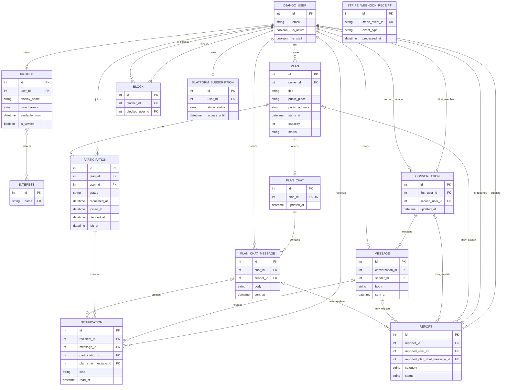

# Kindelise Entity Relationship Diagram

## Relationship summary

| Relationship | Meaning |
| --- | --- |
| User → Profile | Every normal account has one public profile. |
| Profile ↔ Interest | A profile can select several interests, and an interest can belong to several profiles. |
| User → Plan | A user can create several plans. |
| User ↔ Plan | `Participation` preserves pending, confirmed, declined and left membership states. |
| Plan → Plan Chat | The owner and confirmed participants share one plan-specific conversation. |
| Conversation → Message | One private conversation contains messages from its two members. |
| Notification | Direct messages, plan-chat messages and participation changes can create alerts. |
| Block and Report | These records store private safety actions and checked message context. |
| Platform Subscription | An account can have one locally stored Stripe subscription summary. |
| Stripe Webhook Receipt | Stores processed Stripe event IDs to prevent duplicate processing. |

`PK` means primary key, `FK` means foreign key, and `UK` means unique value.
