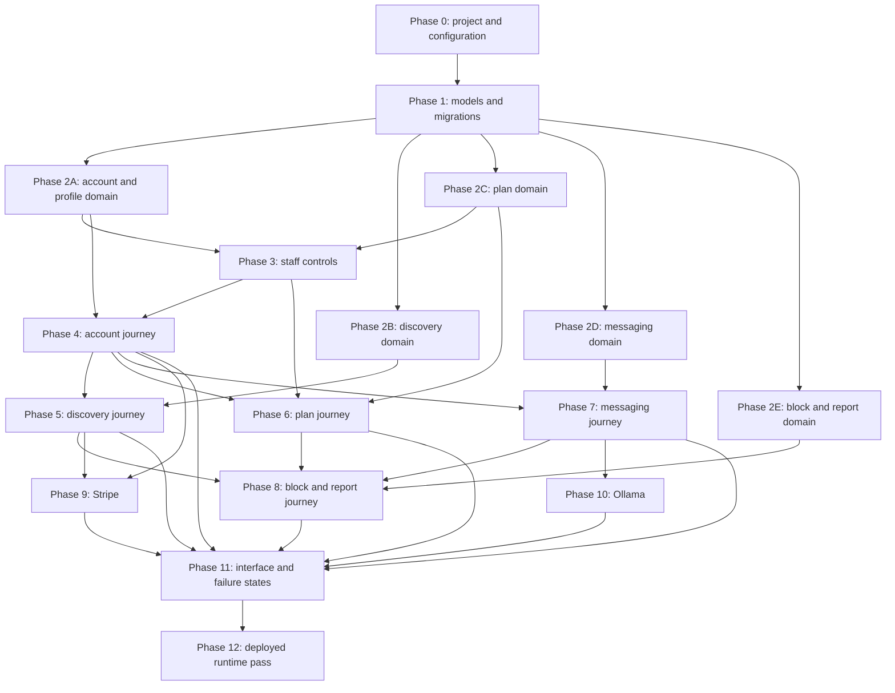

# Kindlelise Student MVP Implementation and Runtime Completion Plan

## 1. Purpose and authority

This document turns the approved Kindlelise vertical slice into an ordered build,
verification and demonstration plan.

[`docs/VERTICAL_SLICE.md`](VERTICAL_SLICE.md) remains the implementation authority.
This plan does not add or redefine a model, field, function, route, template,
provider behaviour or product rule. If the documents disagree, the vertical slice
wins.

This supporting document is outside the 36 implementation-file maximum. Its
creation is explicitly approved because the vertical slice defines **what** to
build but should not also own changing sequencing and runtime evidence rules.
This plan owns the approved phases, dependencies, exit gates and runtime
checklist. [`docs/IMPLEMENTATION_PROGRESS.md`](IMPLEMENTATION_PROGRESS.md) owns
only the mutable State and Evidence ledger. The existing architecture and
requirements documents remain reference contracts; neither is a suitable owner
for implementation progress.

## 2. Completion rule

A phase is complete only when:

1. its listed behaviour works through the mapped public interface;
2. its security and failure cases are tested;
3. its code remains inside the approved file and function owners;
4. its database changes are reviewed on PostgreSQL;
5. its user-facing state is understandable without reading the source; and
6. no deferred feature or speculative abstraction was introduced.

Use these progress states:

| State | Meaning |
| --- | --- |
| Not started | No implementation evidence exists. |
| In progress | Work is contained within the phase, but its exit gate does not pass. |
| Blocked | A specific external decision or provider condition prevents progress. |
| Complete | Every exit-gate item passes and the evidence is recorded. |

Do not mark a phase complete because files exist or a page renders once.

### 2.1 Delivery dependency graph

The phase number supplies the default build order. The arrows below show the
actual prerequisites, so a developer can see why a later phase must wait even
when its files are already present.



Phases 2A–2E remain inside the same approved domain files, but each is a
separately tracked phase with its own focused command and closure record. Work
through them in the listed order unless the dependency graph and recorded
evidence make a different order safe. A dependent phase cannot be Complete
while one of its prerequisites is incomplete.

## 3. Scope guardrails

During every phase:

- use the exact file owners and public function names in the vertical slice;
- prefer Django defaults and the smallest readable implementation;
- do not add files merely to shorten an existing file;
- do not add models, generic repositories, event buses or provider abstractions;
- do not log passwords, sessions, messages, reports, webhook bodies or AI drafts;
- do not call external providers inside a database transaction;
- do not weaken a test or permission check to finish a phase;
- keep the supervised-test-account and non-production-age-verification limitation
  visible in the README and demonstration; and
- follow the vertical-slice boundary-change procedure when the current map truly
  cannot meet an approved requirement.

## 4. Runtime inventory and closure controls

These controls transcribe the approved vertical slice into an auditable runtime
plan. They do not create routes, functions or files.

### 4.1 Account-page template ownership

`templates/account.html` owns five deliberately small rendering modes:

- registration form and Django password-validation errors;
- sign-in form, generic invalid-credential feedback and safe local `next` value;
- inactive-account and unverified-account state;
- the signed-in user's private account/profile state; and
- the read-only public-profile mode allowed by the vertical slice.

`sign_up_page()` and `sign_in_page()` select the first two modes. No Django
default authentication template, extra template or separate authentication route
is required.

### 4.2 Public route and HTTP-method audit

Route names are the stable interface. `kindlelise/urls.py` chooses one readable
path for each name, and templates/tests use Django URL reversing rather than
hard-coded paths. Every approved route appears exactly once below.

| Route name | Methods | Caller authority | View owner | Success | Safe failure |
| --- | --- | --- | --- | --- | --- |
| `home` | GET | Anyone | `home_page` | Redirect by account state | Sign-in redirect |
| `sign_up` | GET, POST | Anonymous | `sign_up_page` | Create account/profile; redirect to sign-in | Bound errors; authenticated user redirects |
| `sign_in` | GET, POST | Anonymous | `sign_in_page` | Start session; safe local redirect | Generic bound error; external `next` refused |
| `sign_out` | POST | Signed in | `sign_out_user` | End session | CSRF/method refusal |
| `account` | GET | Signed in | `account_page` | Private account summary | Sign-in redirect |
| `profile_edit` | GET, POST | Signed in | `edit_profile_page` | Show/save own profile | Bound errors or generic denial |
| `discover` | GET | Active and verified | `discovery_page` | Filtered profile grid | Account gate or bound filter errors |
| `profile_detail` | GET | Active and verified | `profile_page` | Permitted profile | Generic 404 |
| `plan_list` | GET | Active and verified | `plan_list_page` | Permitted plans | Account gate |
| `plan_create` | GET, POST | Active and verified | `create_plan_page` | Pending plan | Bound errors or generic denial |
| `plan_detail` | GET | Active and verified | `plan_detail_page` | Permitted plan | Generic 404 |
| `plan_edit` | GET, POST | Eligible owner | `edit_plan_page` | Saved/resubmitted plan | Bound errors or generic 404 |
| `plan_join` | POST | Eligible non-owner | `join_plan` | Joined locked plan | Generic refusal; no partial join |
| `plan_leave` | POST | Current participant | `leave_plan` | Historical row marked left | Generic refusal |
| `plan_cancel` | POST | Eligible owner | `cancel_plan` | Terminal cancellation | Generic refusal |
| `inbox` | GET | Active and verified | `inbox_page` | Permitted conversations | Account gate |
| `conversation_detail` | GET | Permitted pair member | `conversation_page` | Escaped messages | Generic 404 |
| `direct_conversation_start` | POST | Permitted pair | `start_direct_conversation` | Existing or new unique conversation | Generic refusal |
| `conversation_message_send` | POST | Permitted pair member | `send_conversation_message` | Stored plain text | Bound errors or generic refusal |
| `conversation_message_edit_suggestion` | POST | Permitted pair member | `request_conversation_message_edit_suggestion` | Draft-only suggestion | Preserve original; generic provider error |
| `profile_block_messages_and_discovery` | POST | Signed in | `block_profile_from_discovery_and_messages` | Two-way interaction exclusion | Generic refusal |
| `report_create` | GET, POST | Authenticated reporter | `report_user_page` | Private report/confirmation | Bound errors; generic 404 for invalid context |
| `premium_subscription_checkout` | POST | Signed in | `start_premium_subscription_checkout` | Stripe-hosted redirect | Preserve Free access; generic provider error |
| `premium_subscription_portal` | POST | Owning signed-in account | `open_premium_subscription_portal` | Stripe-hosted redirect | Generic unavailable state |
| `stripe_webhook` | POST | Verified Stripe signature | `receive_and_verify_stripe_webhook` | Acknowledgement/projection | Status contract in 4.5 |

GET never changes state. Every state-changing browser POST uses Django CSRF.
The webhook alone is CSRF-exempt because its exact raw body is authenticated by
Stripe's signature. Unsupported methods receive Django's ordinary `405` response.

### 4.3 Object-denial contract

| Situation | Response rule |
| --- | --- |
| Anonymous request to a signed-in browser page | Redirect to the named sign-in route with a safe local `next`. |
| Authenticated but unverified request to discovery, plans or messages | Redirect to the account page with one generic verification-needed message. |
| Missing, unrelated, blocked, inactive or otherwise hidden object | Return the same generic `404`; do not distinguish why. |
| Invalid submitted form on an otherwise permitted page | Re-render the bound form with field errors and no mutation. |
| Permission changes between display and POST | Recheck in the service and show a generic refusal with no partial mutation. |
| Inactive sign-in or invalid credentials | Show the same generic sign-in failure. |

Plan visibility remains policy-dependent: a permitted owner may see their own
pending or rejected plan, while unrelated users receive the same generic `404`.

### 4.4 Trusted report-context transformation

The route's `profile_id` identifies only an untrusted report target. The view
calls `get_report_target_profile_if_reporter_is_allowed()` and uses a generic
not-found response when it returns no result. That selector applies
`can_report_another_user()` without applying discovery or messaging visibility,
because a block must not prevent reporting. An optional context type and object
identifier are also untrusted. The view retrieves a plan, conversation or message
through the existing reporter-scoped selector for that context and passes at most
one validated object to `submit_private_report_about_user()`. The service repeats
the relationship checks. Browser-supplied owner, participant, sender, visibility
or reported-account values are never authority.

### 4.5 Stripe webhook response contract

| Webhook outcome | HTTP result | Durable result |
| --- | --- | --- |
| Invalid signature or malformed signed JSON | `400` | No receipt or subscription change |
| Valid signature, unsupported event type | `200` | No receipt or subscription change |
| Duplicate already-processed supported event | `200` | No second change |
| Older or safely refused equal-time supported event | `200` | Processed receipt; no projection overwrite |
| Supported event applied successfully | `200` | Receipt and projection committed together |
| Supported event cannot be processed because validation, ownership or database work fails | `500` | Transaction rolls back receipt and projection so Stripe may retry |

Checkout completion stores trusted identifiers but does not advance the
subscription-state ordering cursor. The authoritative equal-time rule is in the
vertical slice and data model: deletion may revoke access at the current cursor;
an equal-time non-deletion event may not overwrite an already accepted state.

### 4.6 Test layers

| Behaviour family | Database constraint | Policy/form unit | Transaction/service | Django HTTP | Manual browser | Deployed |
| --- | :---: | :---: | :---: | :---: | :---: | :---: |
| Account/profile | Yes | Yes | Yes | Yes | Yes | Smoke |
| Discovery/availability | — | Yes | — | Yes | Yes | Smoke |
| Plan/participation | Yes | Yes | Yes, including real join race | Yes | Yes | Smoke |
| Conversation/message | Yes | Yes | Yes, including unique-pair race | Yes | Yes | Smoke |
| Block/report | Yes | Yes | Yes | Yes | Yes | Smoke |
| Stripe | Yes | — | Yes with fake signed events | Yes | Test-mode pass | Webhook smoke |
| Ollama | — | Form validation | Fake provider boundary | Yes | Success/failure | Remote failure/success |

Every mapped public service function must have at least one success test and one
refusal or failure-state test. Every mutating service must also prove that a
failed operation leaves no partial state. Each selector needs a positive result
test and the privacy/visibility exclusions relevant to that selector. These are
contract expectations, not a percentage-only coverage target.

Before deployment, Phase 11 runs the complete local journey against a fresh
PostgreSQL database. Phase 12 confirms an already-integrated revision; it is not
the first integration run.

### 4.7 Environment matrix

| Environment | PostgreSQL | Stripe | Ollama | `DEBUG` | Static files | Purpose |
| --- | --- | --- | --- | --- | --- | --- |
| Automated test | Real test database | Fakes | Fake boundary | Controlled false | Collection checked | Repeatable proof |
| Local demo | Local PostgreSQL | Stripe test mode/CLI | Ollama Cloud or fake failure | True | Django development serving | Development and assessment practice |
| Heroku assessment | Managed PostgreSQL | Stripe test mode | Ollama Cloud over outbound HTTPS | False | WhiteNoise production path | Final demonstration |

The deployed Ollama process is Ollama Cloud, not a local process uploaded into a
Heroku web dyno. `OLLAMA_API_URL`, `OLLAMA_API_KEY`, one pinned model and a short
timeout define the boundary. The final pass proves network reachability, model
availability, timeout behaviour and preservation of the original draft. Cold
start or Free-plan unavailability is a normal provider-failure state, not a
reason to lose or send the draft.

### 4.8 Phase closure record

Every phase records this exact evidence before its State becomes Complete:

```text
Commit or immutable revision:
Environment and PostgreSQL database:
Focused command and result:
Full regression command and result:
Manual success proof:
Failure/security proof:
Known limitations:
Rollback or reset used/tested:
Reviewer:
Date:
```

The focused commands are listed with each phase below. From Phase 1 onward, the
regression command after every phase is:

```text
pytest tests/test_vertical_slice.py
```

Test names must include their documented domain words so `-k` selection is
reliable. A failed focused or regression command keeps the phase In progress.
Phase 0 records the full-regression field as not applicable because
`tests/test_vertical_slice.py` is first created in Phase 1.

| Phase | Focused closure command |
| ---: | --- |
| 0 | `python manage.py check && python manage.py collectstatic --noinput` |
| 1 | `python manage.py makemigrations --check --dry-run && python manage.py migrate && pytest tests/test_vertical_slice.py -k "constraint or index or migration or interest"` |
| 2A | `pytest tests/test_vertical_slice.py -k "account or profile"` |
| 2B | `pytest tests/test_vertical_slice.py -k "discovery or availability or premium_limit"` |
| 2C | `pytest tests/test_vertical_slice.py -k "plan or participation or capacity or join or leave or cancel"` |
| 2D | `pytest tests/test_vertical_slice.py -k "conversation or message"` |
| 2E | `pytest tests/test_vertical_slice.py -k "block or report"` |
| 3 | `pytest tests/test_vertical_slice.py -k "admin or staff or verification or approval"` |
| 4 | `pytest tests/test_vertical_slice.py -k "registration or sign_in or sign_out or account or profile"` |
| 5 | `pytest tests/test_vertical_slice.py -k "discovery or availability or premium_limit"` |
| 6 | `pytest tests/test_vertical_slice.py -k "plan or participation or capacity or join or leave or cancel"` |
| 7 | `pytest tests/test_vertical_slice.py -k "conversation or message"` |
| 8 | `pytest tests/test_vertical_slice.py -k "block or report"` |
| 9 | `pytest tests/test_vertical_slice.py -k "stripe or premium or webhook or checkout or portal"` |
| 10 | `pytest tests/test_vertical_slice.py -k "ollama or draft or suggestion"` |
| 11 | `pytest tests/test_vertical_slice.py && python manage.py collectstatic --noinput` plus the recorded browser checklist |
| 12 | `python manage.py check --deploy && python manage.py makemigrations --check --dry-run && pytest && python manage.py collectstatic --noinput` |

Shell `&&` means a later check runs only after the previous check succeeds; it
does not authorize hiding or skipping a failure.

### 4.9 Rollback and recovery rehearsal

This is a small assessment-deployment safeguard, not the production disaster
recovery, Stripe reconciliation or monitoring system deferred by the vertical
slice.

- Before a migration or deployment, record the current immutable revision, the
  target revision and a current PostgreSQL backup or disposable-database reset
  point.
- Rehearse each migration both forward and, when Django marks it reversible,
  backward on a throwaway PostgreSQL database. Never test a destructive reversal
  first against the assessment database.
- For a code-only release failure, restore the previous immutable revision, run
  Django checks and a smoke request, and record the result.
- For a failed release containing an unsafe or irreversible schema/data change,
  restore the recorded backup into a controlled database and deploy the matching
  previous revision. Do not improvise row deletion or edit migration history.
- After a failed Stripe deployment, retain webhook receipts and provider event
  identifiers. Restore the last good application revision, then use Stripe test
  mode to redeliver only events that did not commit successfully; never grant
  Premium manually to hide a recovery failure.
- Provider unavailability alone does not justify a data rollback: Stripe keeps
  Free access safe, and Ollama preserves the original draft.

The phase closure record names the reset or rollback actually rehearsed. “Not
applicable” must include a reason; a blank field is not evidence.

### 4.10 Performance verification

Performance checks use PostgreSQL, `DEBUG = false`, warmed application code and
provider calls excluded. Record the machine/environment, fixture size and raw
results so the measurements are repeatable. These are student-MVP acceptance
budgets, not a public production SLA.

- Discovery, plan-list and inbox rendering must have no N+1 query pattern: query
  counts stay constant when the visible fixture grows from 5 to 50 rows.
- On a local assessment fixture of at least 50 relevant rows per page, 20 warmed
  authenticated GETs to each of those pages target a median below 200 ms and a
  95th percentile below 500 ms.
- The concurrency tests remain correctness gates; a faster result never excuses
  a capacity, uniqueness or privacy failure.
- A missed budget keeps Phase 11 In progress until the query plan is corrected or
  the measured constraint and accepted limitation are recorded explicitly.

### 4.11 Content-safe logging and lightweight monitoring

Emit concise operational events from the existing views, admin actions and
services; do not add a logging service, route, model, dependency or background
worker. Log an event name, outcome and safe local record IDs where useful, but
never user text, credentials, secrets, raw provider bodies or attempted emails
on a failed sign-in.

The minimum content-safe events are successful sign-in/sign-out, generic sign-in
failure, profile verification/removal, plan approval/rejection, private-report
creation, Stripe signature/duplicate/applied/retry outcomes and Ollama
timeout/malformed-response outcomes. A report event contains the report ID and
creation outcome only, never its category, description or copied context text.

For the assessment deployment:

- issue a smoke request to the existing `home` route after each deploy; do not add
  a health-check route;
- inspect platform/application logs after deployment and before demonstration for
  unexplained HTTP 500s, database errors, failed Stripe webhooks and Ollama
  failures;
- treat every Stripe `500` as retryable and investigate it before Phase 12 can
  complete; and
- record expected provider-failure exercises separately from unexpected
  exceptions so a working fallback does not hide an outage.

This manual evidence closes the student runtime pass. Automated alerting,
long-term metrics, reconciliation jobs and production incident response remain
future work.

## 5. Progress ownership

Record phase State and Evidence only in
[`docs/IMPLEMENTATION_PROGRESS.md`](IMPLEMENTATION_PROGRESS.md). That ledger may
reflect completed work but cannot define a phase, add an outcome or weaken an
exit gate in this plan.

## 6. Phase 0 — Project skeleton and configuration

### Files

```text
.gitignore
.env.example
README.md
manage.py
pyproject.toml
config/__init__.py
config/settings.py
config/urls.py
config/asgi.py
config/wsgi.py
kindlelise/__init__.py
kindlelise/apps.py
kindlelise/migrations/__init__.py
```

### Work

- Create the standard Django project and single `kindlelise` application.
- Install only the approved runtime and test dependencies.
- Configure PostgreSQL, templates, WhiteNoise static-file serving, authentication,
  secure cookies, trusted hosts and environment-based secrets.
- Define the approved `KINDLELISE_AREAS` and `KINDLELISE_NEARBY_AREAS` values
  from the vertical slice in `settings.py`.
- Add safe placeholder names for Django, PostgreSQL, Stripe and Ollama
  configuration to `.env.example`; include no working secret.
- Mount Django Admin in `config/urls.py`. Defer the application include until
  Phase 4 creates `kindlelise/urls.py`; do not create an empty route placeholder.
- Document email authentication, supervised test accounts and local setup in
  the README.

### Exit gate

```text
python manage.py check
python manage.py collectstatic --noinput
```

must succeed with PostgreSQL configuration available, and no secret may exist in
tracked files or application logs.

## 7. Phase 1 — Durable model and migration foundation

### Files

```text
kindlelise/models.py
kindlelise/migrations/*
tests/conftest.py
tests/test_vertical_slice.py
```

### Work

- Implement Django `User` integration and the ten approved Kindlelise models.
- Implement only the four mapped read-only model helpers:
  `Profile.is_available_now(at_time)`, `Plan.is_open_for_joining(at_time)`,
  `Conversation.includes_account(user)` and
  `PlatformSubscription.has_premium_access()`.
- Add every mapped uniqueness constraint, check constraint, index and explicit
  foreign-key deletion rule.
- Keep `PlatformSubscription.stripe_status` nullable until a supported
  subscription event supplies it.
- Generate and review the schema migration.
- Add one reviewed data migration containing exactly Coffee, Walking, Museums,
  Live music, Cinema, Food, Games and Study.
- Build only the approved test helpers.

### Schema-first tests

- Verification state agrees with `verified_at` and `verified_by`.
- Approval state agrees with `approved_at` and `approved_by`.
- Participation state agrees with `left_at`.
- Plan capacity is greater than zero.
- A report cannot target its reporter and has zero or one context reference.
- Conversation pairs are different, lower-ID-first and unique.
- Blocks cannot target self and are unique per direction.
- Non-null Stripe customer and subscription identifiers are unique, and every
  webhook event ID is unique.
- Every mapped non-unique index exists.

### Exit gate

```text
python manage.py makemigrations --check --dry-run
python manage.py migrate
```

must succeed on PostgreSQL. The generated migration must contain the reviewed
constraints and indexes, and a fresh database must contain the eight interests.
Do not begin views or templates before this gate passes.

## 8. Phase 2A — Account and profile domain

### Files

```text
kindlelise/forms.py
kindlelise/policies.py
kindlelise/services.py
kindlelise/selectors.py
tests/test_vertical_slice.py
```

### Domain build order

1. Forms normalise untrusted input and reject unknown choices.
2. Policies answer the mapped permission questions without changing state.
3. Services recheck permission and own atomic state changes.
4. Selectors apply privacy exclusions before returning presentation data.

| Owner | Approved functions/classes | Reads and inputs | Changes | Refusal and transaction proof |
| --- | --- | --- | --- | --- |
| Forms | `AccountSignUpForm`, `ProfileDetailsForm` | Submitted email/password and the signed-in user's editable profile fields | None | Reject duplicate/invalid email, bad passwords, empty display name, unknown area/interest and oversized text |
| Policy | `can_access_discovery_plans_and_messages()` | Authenticated account, active flag and verification fields | None | False for every missing, inactive, anonymous or unverified state |
| Services | `create_account_and_profile()`, `update_signed_in_user_profile()` | Validated form values plus server-known user | User/profile/interests/availability only | Account/profile creation is atomic; browser authority fields are ignored |
| Selector | `get_signed_in_user_account_summary()` | Signed-in account | None | Returns only that account's safe account, verification, plan and subscription summary |

Tests prove account/profile atomicity, canonical email authentication, ownership,
stable area keys, availability replacement/clearing and server-controlled
verification. No row lock is needed beyond normal atomic account/profile creation.

### Exit gate

All provider-independent account/profile form, policy, service and selector
behaviour passes without a page or live provider call.

Focused command:

```text
pytest tests/test_vertical_slice.py -k "account or profile"
```

## 9. Phase 2B — Discovery and availability domain

### Files

```text
kindlelise/forms.py
kindlelise/policies.py
kindlelise/selectors.py
tests/test_vertical_slice.py
```

| Owner | Approved functions/classes | Reads and inputs | Changes | Refusal and transaction proof |
| --- | --- | --- | --- | --- |
| Form | `DiscoveryFiltersForm` | Current account, configured area keys, interest IDs and available-now choice | None | Reject unknown/excessive filters before querying |
| Policies | `get_allowed_discovery_areas_and_interest_limit()`, `can_show_profile_in_discovery_grid()`, `can_view_profile_page()` | Current subscription projection, both profiles and either-direction blocks | None | Verification and blocks always win over Premium |
| Selectors | `get_profiles_for_discovery_grid()`, `get_profile_page_if_viewer_is_allowed()` | Validated filters and server-known viewer | None | Apply exclusions before presentation; hidden object returns no existence detail |

Tests prove Free/Premium limits, future-only availability, broad-area filtering,
self/inactive/unverified/block exclusions and direct profile denial. This group is
read-only and requires no transaction lock.

### Exit gate

All provider-independent discovery and availability form, policy and selector
behaviour passes without a page or live provider call.

Focused command:

```text
pytest tests/test_vertical_slice.py -k "discovery or availability or premium_limit"
```

## 10. Phase 2C — Plan and participation domain

### Files

```text
kindlelise/forms.py
kindlelise/policies.py
kindlelise/services.py
kindlelise/selectors.py
tests/test_vertical_slice.py
```

| Owner | Approved functions/classes | Reads and inputs | Changes | Refusal and transaction proof |
| --- | --- | --- | --- | --- |
| Form | `PlanDetailsForm` | User-entered plan fields | None | Reject invalid bounds, time or a non-HTTPS URL; never fetch, substantiate or approve the venue evidence |
| Policies | `can_create_plan_for_staff_review()`, `can_join_approved_plan()` | Account, plan state and supplied current time | None | Fail closed for unverified, owner, past, full, cancelled, unapproved or already-joined participation; an existing `left` row remains eligible for service reactivation |
| Services | `create_plan_waiting_for_staff_review()`, `update_owned_plan_before_first_join()`, `join_approved_plan_and_lock_meeting_details()`, `leave_plan_and_keep_participation_history()`, `cancel_owned_plan_and_hide_it_from_discovery()` | Validated values and server-retrieved user/plan | Plan, approval fields, lock time and participation state only | Join locks the plan with `select_for_update()` and recounts inside one transaction; all workflows recheck current state |
| Selectors | `get_plans_for_plan_list()`, `get_plan_page_if_viewer_is_allowed()` | Viewer, current time and requested plan | None | Public results contain approved future plans only; owner-only states do not leak |

Tests prove every state transition, approval reset, permanent first-join lock,
leave/rejoin history, owner cancellation and a real PostgreSQL capacity race.

### Exit gate

All provider-independent plan and participation form, policy, service and selector
behaviour passes, including the real PostgreSQL join race, without a page or live
provider call.

Focused command:

```text
pytest tests/test_vertical_slice.py -k "plan or participation or capacity or join or leave or cancel"
```

## 11. Phase 2D — Conversation and message domain

### Files

```text
kindlelise/forms.py
kindlelise/policies.py
kindlelise/services.py
kindlelise/selectors.py
tests/test_vertical_slice.py
```

| Owner | Approved functions/classes | Reads and inputs | Changes | Refusal and transaction proof |
| --- | --- | --- | --- | --- |
| Form | `MessageDraftForm` | One submitted plain-text draft | None | Reject empty or oversized text |
| Policy | `can_start_or_continue_direct_messages()` | Both accounts and either-direction blocks | None | False unless both distinct accounts are active, verified and unblocked |
| Services | `find_or_start_direct_conversation()`, `send_direct_message()` | Server-known accounts/conversation and validated draft | Unique ordered pair, message and conversation update time | Unique database conflict retrieves the existing pair; send rechecks membership and block state |
| Selectors | `get_unblocked_conversations_for_inbox()`, `get_messages_if_user_can_open_conversation()` | Signed-in account and requested conversation | None | Exclude blocked pair before names/previews/text reach presentation |

Tests prove one conversation under simultaneous creation, member-only reads,
escaped rendering boundary, message limits and immediate block refusal.

### Exit gate

All provider-independent conversation and message form, policy, service and
selector behaviour passes, including the unique-pair race, without a page or
live provider call.

Focused command:

```text
pytest tests/test_vertical_slice.py -k "conversation or message"
```

## 12. Phase 2E — Blocking and private-report domain

### Files

```text
kindlelise/forms.py
kindlelise/policies.py
kindlelise/services.py
kindlelise/selectors.py
tests/test_vertical_slice.py
```

| Owner | Approved functions/classes | Reads and inputs | Changes | Refusal and transaction proof |
| --- | --- | --- | --- | --- |
| Form | `PrivateReportForm` | Category and bounded factual description | None | Reject unknown category or oversized text; reporter, target and optional context stay server-controlled |
| Policy | `can_report_another_user()` | Authenticated reporter and different target | None | Blocking does not prevent reporting; self-report and anonymous report fail |
| Services | `block_user_from_discovery_and_messages()`, `submit_private_report_about_user()` | Server-known accounts and server-validated optional object | One directional block or one private report | Unique block is idempotent; invalid context creates no partial report |
| Selectors | `get_report_target_profile_if_reporter_is_allowed()` plus plan and conversation/message selectors from 2C–2D | Reporter, untrusted target profile ID and optional context type/object ID | None | Resolve an allowed different target even after a block; retrieve only a plan, conversation or message context the reporter was allowed to see; service revalidates relationships |

Tests prove two-way interaction exclusion, report privacy and zero-or-one relevant
plan/conversation/message context for the server-resolved target profile. No
notification or finding is created.

### Exit gate

All provider-independent block/report form, policy, service and selector
behaviour passes without a page or live provider call. Stripe and Ollama
boundaries remain gated to Phases 9 and 10.

Focused command:

```text
pytest tests/test_vertical_slice.py -k "block or report"
```

## 13. Phase 3 — Manual staff controls

### Files

```text
kindlelise/admin.py
tests/test_vertical_slice.py
```

### Work

- Register the approved models with ordinary Django Admin.
- Implement the four mapped staff actions:
  `verify_selected_profiles_for_discovery_plans_and_messages()`,
  `remove_verification_from_selected_profiles()`,
  `approve_selected_plans_after_manual_url_check()` and
  `reject_selected_plans()`.
- Extend Django's existing User change Permissions section with the mapped
  `Profile verified` checkbox. Require both User and Profile change permission,
  reuse the profile-completion rule and keep the reviewer/time fields consistent.
- Grant verification only when the profile has a non-empty display name and a
  broad-area key currently present in `KINDLELISE_AREAS`.
- Iterate selected rows and recheck each state instead of using a blind bulk
  update.
- Removing verification clears `verified_at` and `verified_by`; every non-approved
  plan state retains null `approved_at` and `approved_by` under the mapped
  edit/reject/cancel workflows.
- Keep reports, subscriptions and webhook receipts staff-visible but do not add a
  moderation dashboard or custom provider queue.

### Exit gate

An authorised staff account can move only eligible records through the documented
states, receives an understandable changed/skipped count for bulk actions,
cannot verify an incomplete profile through either Admin control and cannot
approve a cancelled, locked, past or otherwise ineligible plan. The User
Permissions checkbox is absent without Profile change permission.

## 14. Phase 4 — Account and profile journey

### Files

```text
kindlelise/views.py
kindlelise/urls.py
config/urls.py
templates/base.html
templates/account.html
static/app.css
tests/test_vertical_slice.py
```

### Runtime journey

```text
visitor
→ email registration
→ atomic User + unverified Profile
→ sign in with the new email
→ private account page
→ profile editing
→ staff verification
→ verified home redirect to discovery
```

### Required behaviour

- Successful registration creates both records and redirects to the named sign-in
  route without starting an authenticated session.
- Sign-in errors do not reveal whether an email exists.
- Sign-out is a CSRF-protected POST.
- Safe local post-login redirects are allowed; external redirects are refused.
- Verified users go to discovery, unverified users to their account page and
  unauthenticated users to sign-in.
- Users can edit only their own mapped profile fields.
- Availability can be set, replaced and cleared.

### Exit gate

The journey works through normal HTTP requests with understandable invalid,
unverified and inactive states.

## 15. Phase 5 — Discovery and availability

### Files

```text
templates/discover.html
kindlelise/forms.py
kindlelise/policies.py
kindlelise/selectors.py
kindlelise/views.py
kindlelise/urls.py
tests/test_vertical_slice.py
```

### Runtime journey

```text
verified user
→ permitted area and interest filters
→ optional Free now filter
→ selector removes self, inactive, unverified and either-direction-blocked rows
→ profile grid
→ authorised profile detail
```

### Exit gate

- Free users can use only their area and two interest filters.
- Current Premium users can use mapped nearby areas and five interest filters.
- Free now matches only an `available_from` start that has arrived.
- Exact location, hidden-result counts and exclusion reasons never appear.
- Direct requests cannot open a profile excluded by current policy.

## 16. Phase 6 — Plans and participation

### Files

```text
templates/plan.html
kindlelise/forms.py
kindlelise/policies.py
kindlelise/services.py
kindlelise/selectors.py
kindlelise/views.py
kindlelise/urls.py
tests/test_vertical_slice.py
```

### Runtime journey

```text
verified owner creates plan
→ Pending review
→ staff manually checks public place and URL
→ Approved or Rejected
→ approved future plan appears publicly
→ non-owner joins
→ plan row locks and whole plan becomes read-only
→ participant leaves or rejoins; owner may cancel
```

### State proof

- Pending, approved-before-first-join and rejected plans are editable by their
  owner under the mapped rules.
- Saving a rejected plan resubmits it as Pending.
- Changing an approved plan's public place, public URL or start time resets
  approval and clears review fields.
- Cancelled is terminal and cannot be edited, approved or reactivated.
- The owner cannot join and does not consume participant capacity.
- Leaving preserves participation and never unlocks the plan.
- Rejoining reuses the row only when all current joining rules pass.

### Concurrency gate

Use PostgreSQL `TransactionTestCase` with separate database connections to prove
that simultaneous joins cannot exceed capacity. A sequential mock is not enough.

## 17. Phase 7 — Direct messaging

### Files

```text
templates/inbox.html
templates/conversation.html
kindlelise/forms.py
kindlelise/policies.py
kindlelise/services.py
kindlelise/selectors.py
kindlelise/views.py
kindlelise/urls.py
tests/test_vertical_slice.py
```

### Runtime journey

```text
authorised profile
→ start conversation
→ lower account ID stored first
→ unique pair returned
→ bounded plain-text send
→ normal page refresh shows escaped message
```

### Exit gate

- Simultaneous conversation starts return one authoritative pair; the service
  catches the unique conflict and fetches the existing conversation.
- Only members of an active verified unblocked pair can open or send.
- Message bodies are stored as text, escaped in templates and absent from logs.
- No attachment, read receipt, WebSocket or sent-message editing appears.

## 18. Phase 8 — Blocking and private reporting

### Files

```text
templates/account.html
templates/plan.html
templates/conversation.html
templates/report.html
kindlelise/forms.py
kindlelise/policies.py
kindlelise/services.py
kindlelise/selectors.py
kindlelise/views.py
kindlelise/urls.py
tests/test_vertical_slice.py
```

### Blocking pass

- Block is a CSRF-protected POST.
- One directional record immediately produces two-way discovery and messaging
  exclusion.
- Inbox selectors remove names, previews and text before rendering.
- The blocked account receives no notification.
- Blocking does not prevent a valid private report.

### Reporting pass

- Report is reachable from profile, plan, conversation and eligible received
  message context through the one mapped route.
- The route target is resolved server-side under `can_report_another_user()`
  by `get_report_target_profile_if_reporter_is_allowed()` without applying
  discovery or messaging visibility, so a block cannot suppress a report;
  missing or invalid targets receive the generic not-found response.
- The browser cannot establish a trusted context by submitting an arbitrary ID.
- Both accounts must connect to a referenced plan as owner or participant.
- Conversation context contains both accounts.
- Message context belongs to that conversation and was visible to the reporter.
- The reporter receives submission confirmation only; the reported account and
  unrelated ordinary users cannot see the durable report.
- Invalid context creates no partial report.

### Exit gate

Blocking closes discovery and direct messaging in either direction, while
reporting remains available, private and non-adjudicative.

## 19. Phase 9 — Stripe Premium

### Files

```text
config/settings.py
kindlelise/services.py
kindlelise/views.py
kindlelise/urls.py
templates/account.html
tests/conftest.py
tests/test_vertical_slice.py
```

### Build order

1. Configure one recurring Stripe price for GBP 499 (£4.99) per year and place
   only that test/live environment's price ID in `STRIPE_PRICE_ID`.
2. Implement `start_stripe_subscription_checkout()` to create one hosted Checkout
   session. For an account without recorded Stripe history, apply exactly 30
   trial days, `payment_method_collection=if_required` and missing-payment-method
   end behaviour `create_invoice`; for any later eligible Checkout, omit the
   trial. Refuse a duplicate active or trialing subscription.
3. Put the immutable local user ID in `client_reference_id` and subscription
   metadata.
4. Construct Checkout success/cancellation and portal-return URLs on the server
   from the named account route.
5. Verify the webhook signature against the exact raw request body.
6. Accept only `checkout.session.completed`, `customer.subscription.updated`,
   `invoice.paid` and `customer.subscription.deleted`.
7. Implement `update_premium_access_from_verified_stripe_event()` to apply receipt
   and subscription projection changes atomically and in provider time order.
8. Grant trial access only from `trialing` with a future trial end. Grant a paid
   annual period only from `invoice.paid` for the linked configured price and
   active subscription; never extend paid access from active status alone.
9. Implement `open_stripe_customer_portal()` to open Stripe's hosted invoice and
   customer-management surface only for
   the signed-in account's recorded customer ID.

### Provider tests

- Checkout and browser return never grant access.
- First eligible Checkout uses GBP 499 per year, exactly 30 trial days, no
  required upfront payment method and post-trial invoice creation.
- A local account cannot receive a second trial or duplicate an active/trialing
  subscription; any later eligible Checkout uses no trial.
- Ownership never comes from email.
- Conflicting Stripe identifiers are rejected rather than reassigned.
- Unsupported signed events create no receipt or subscription change.
- Duplicate supported event IDs are harmless.
- Older events cannot overwrite newer accepted state.
- A delayed paid invoice can extend only a still-active, non-revoked subscription
  to its later service-period end; it cannot rewind status or revive cancellation.
- Checkout completion does not advance `latest_provider_event_at`; an equal-time
  deletion may revoke access and an equal-time non-deletion cannot overwrite
  accepted state.
- A trialing update grants only the bounded trial; active status alone and every
  unpaid, past-due, missing or expired state deny paid Premium.
- Only a valid paid invoice for the linked configured annual price extends paid
  access to its future annual service-period end.
- Failed supported processing commits no receipt or partial subscription update.
- Deletion sets status to cancelled, clears `access_until`, retains Stripe IDs and
  updates `latest_provider_event_at`.
- Premium changes only area and interest-filter limits.

### Exit gate

Automated tests use fake signed events. A separate supervised Stripe test-mode pass
proves Checkout, webhook receipt, account display and portal return without real
card data or production credentials.

## 20. Phase 10 — Ollama draft editing

### Files

```text
kindlelise/ai_message_editor.py
kindlelise/forms.py
kindlelise/views.py
kindlelise/urls.py
static/app.js
templates/conversation.html
tests/conftest.py
tests/test_vertical_slice.py
```

### Runtime journey

```text
authorised conversation
→ user writes unsent bounded draft
→ chooses Fix grammar or Improve clarity
→ server rechecks conversation access
→ Ollama receives only draft + fixed goal
→ bounded suggestion shown beside original
→ user accepts or rejects
→ normal message validation
→ user manually sends
```

`MessageEditRequestForm` accepts only `fix_grammar` or `improve_clarity` and the
bounded unsent draft. `get_edited_message_draft_suggestion()` owns the one Ollama
Cloud request. `requestMessageDraftEditSuggestion()` calls the conversation-bound
view with CSRF protection, and `showMessageDraftEditSuggestion()` keeps both
choices visible and changes the text box only after acceptance.

### Exit gate

- Empty drafts and unsupported goals cause no provider call.
- Non-members, unverified users and either-direction blocks cause no provider call.
- Timeout, malformed output and oversized output preserve the original draft.
- Drafts and suggestions are not stored or logged.
- JavaScript never sends the message automatically.
- Normal messaging still works without JavaScript or Ollama.

## 21. Phase 11 — Interface, accessibility, performance and failure-state pass

### Files

```text
templates/base.html
templates/discover.html
templates/account.html
templates/plan.html
templates/inbox.html
templates/conversation.html
templates/report.html
static/app.css
static/app.js
```

### Page pass

- Four primary destinations remain Discover, Plans, Messages and Profile.
- Every mapped action appears only when currently authorised.
- Loading, empty, validation, provider-failure, offline and restricted states use
  plain language.
- Manual profile verification and URL approval make no identity, age or venue
  safety claim.
- Stripe payment makes no verification or safety claim.
- AI output is labelled as a suggestion.
- User text is never rendered with `safe`.
- A keyboard-only pass completes every core flow in logical order with a visible
  focus indicator and no keyboard trap.
- Every input and action has an accessible name; help and errors are
  programmatically associated with the affected field, and status or errors are
  not conveyed by colour alone.
- Text and interactive controls meet WCAG AA contrast, touch targets are usable,
  and content remains operable at 200% zoom and a 320 CSS-pixel viewport without
  two-dimensional scrolling.
- A recorded Lighthouse accessibility audit scores at least 90 on a public page
  and representative signed-in list, detail and form pages. The manual
  keyboard/screen-reader-label checks still apply even when the score passes.
- Core account, plan, message, block and report flows work without JavaScript.

### Exit gate

Complete the acceptance checklist in `docs/WIREFRAMES.md` at narrow mobile and
ordinary desktop widths, including empty and failure states rather than success
screens only. Record the accessibility evidence above and the performance/query
results from 4.10 in the phase closure record.

## 22. Phase 12 — Runtime completion pass

Run this pass against the same commit intended for assessment. Do not make an
unreviewed feature change during the pass.

### 22.1 Boot and configuration

```text
[ ] Required environment variables are present.
[ ] DEBUG is false in the deployed environment.
[ ] Allowed hosts, CSRF origins, HTTPS redirect and secure cookies are correct.
[ ] PostgreSQL is reachable; no SQLite fallback is silently used.
[ ] Migrations apply from an empty database.
[ ] Eight interests exist once after migration.
[ ] Static files collect and load.
[ ] Django system checks pass.
[ ] The web process serves config.wsgi through Gunicorn.
```

The current implementation map has no `Procfile`. Confirm the assessment Heroku
application already has a valid `gunicorn config.wsgi` web-process command. If a
new process-definition file is required, stop and use one unallocated file slot
through the boundary-change procedure before adding it.

### 22.2 Database truth

```text
[ ] All ten Kindlelise models and Django User migrate on PostgreSQL.
[ ] Every mapped check and uniqueness constraint rejects contradictory state.
[ ] Every required index appears in PostgreSQL.
[ ] Concurrent joins do not exceed plan capacity.
[ ] Concurrent conversation creation produces one pair.
[ ] No deferred model or field appears.
```

### 22.3 Account and staff journey

```text
[ ] Register with email and password, then sign in with the new account.
[ ] Arrive at the unverified private account page after sign-in.
[ ] Edit only permitted profile fields.
[ ] Staff grant verification through Django Admin.
[ ] Verified home route opens discovery.
[ ] Staff removal of verification immediately closes social access.
```

### 22.4 Discovery and plan journey

```text
[ ] Free and Premium area/interest limits are visibly different.
[ ] Free now includes only an availability start that has arrived.
[ ] Either-direction block removes discovery visibility.
[ ] Create a Pending plan and approve it manually.
[ ] Change an Approved plan's public place, URL or start time before joining and
    observe required re-review.
[ ] Edit a Rejected plan and observe resubmission as Pending.
[ ] Join and observe the permanent whole-plan edit lock.
[ ] Leave and rejoin using one participation row.
[ ] Cancel and confirm the plan cannot become approved or joinable again.
```

### 22.5 Messaging, block and report journey

```text
[ ] Start one direct conversation for the account pair.
[ ] Send and refresh an escaped plain-text message.
[ ] Block and confirm both conversation and discovery access close.
[ ] Submit a valid report despite the block.
[ ] Submit from a target profile and separately exercise valid plan, conversation
    and eligible message context.
[ ] Reject unrelated or multiple context without a partial report.
[ ] Confirm the reported account receives no report visibility or notification.
```

### 22.6 Stripe journey

```text
[ ] The configured test-mode Price is GBP 4.99 recurring yearly.
[ ] A first Checkout uses server-built local return URLs, grants 30 trial days
    and does not require payment details upfront.
[ ] A second trial is refused; an active/trialing subscription is not duplicated.
[ ] Checkout return remains Free before the authoritative update.
[ ] A signed trialing update grants only bounded trial access.
[ ] At trial end Stripe creates the GBP 4.99 invoice and its hosted payment
    surface is reachable from the owning account.
[ ] Active status without payment does not extend access; a signed paid invoice
    grants one bounded annual Premium period.
[ ] Duplicate, old, equal-time, unsupported and invalid events return the
    documented response and preserve or change state exactly as specified.
[ ] Deletion removes access but retains provider identifiers.
[ ] Customer portal opens only for the owning account.
```

### 22.7 Ollama journey

```text
[ ] Fix grammar and Improve clarity send only the current unsent draft.
[ ] Original and suggestion are both visible before acceptance.
[ ] Rejecting a suggestion preserves the original.
[ ] Accepting still requires ordinary validation and manual Send.
[ ] Provider timeout/failure preserves the draft and exposes no private content.
```

### 22.8 Privacy, operational events and monitoring

```text
[ ] Logs contain no password, session, message body or report description.
[ ] Logs contain no raw Stripe body, secret, Ollama draft or suggestion.
[ ] Required content-safe authentication, staff, report, Stripe and Ollama
    outcomes are present without attempted emails or private content.
[ ] The post-deploy home-route smoke request succeeds.
[ ] There are no unexplained HTTP 500s, database errors or failed Stripe webhook
    retries in the assessment window.
[ ] Expected provider-failure exercises are distinguishable from unexpected
    exceptions.
[ ] Pages contain no exact coordinates or private participant directory.
[ ] Restricted-object responses do not reveal whether hidden data exists.
[ ] Card and bank data never enter Kindlelise forms or storage.
```

### 22.9 Rollback and restore evidence

```text
[ ] The deployed revision and previous known-good revision are recorded.
[ ] A current PostgreSQL backup or documented disposable reset point exists.
[ ] Migration rollback/forward was rehearsed on throwaway PostgreSQL where the
    migration is reversible.
[ ] Code rollback and the post-rollback check/smoke sequence are documented.
[ ] Stripe test-event redelivery after a failed transaction is demonstrated
    without duplicate access or manual entitlement edits.
```

### 22.10 Automated verification

Run the project-defined equivalents of:

```text
python manage.py check --deploy
python manage.py makemigrations --check --dry-run
pytest
python manage.py collectstatic --noinput
```

Record the command, date, environment and result. A failing command keeps Phase 12
in progress; do not replace it with a verbal assurance.

## 23. Demonstration script

Prepare deterministic supervised accounts and perform this short assessment path:

```text
1. Register an email, sign in and show the unverified gate.
2. Verify the profile in Django Admin.
3. Discover another verified profile using a broad-area filter.
4. Create and manually approve a public-place plan.
5. Join from a second account and show the permanent plan lock.
6. Start a conversation and send escaped plain text.
7. Request an Ollama grammar suggestion, review it and manually send.
8. Block the other account and show the access boundary.
9. Submit a private report with valid context.
10. Show Stripe test-mode Premium being granted only by a verified webhook.
```

Keep a provider-failure example ready for Stripe and Ollama. Explain what the MVP
deliberately does not claim: identity or age proof, venue safety, emergency
response, formal moderation findings or production readiness.

## 24. Definition of done

The student MVP is complete only when:

- every phase listed in the implementation progress ledger, including 2A–2E
  separately, has a Complete closure record;
- all mapped behaviour tests pass on PostgreSQL;
- the full runtime pass succeeds on the deployed assessment commit;
- the demonstration can be repeated from clean supervised accounts;
- no provider secret or private content appears in source or logs;
- the implementation stays within the approved model, function, route and file
  boundaries;
- README setup matches the actual commands and deployed configuration;
- known production limitations are stated honestly; and
- no required outcome depends on an undocumented manual repair.

Completion means the approved student journey works reliably and can be explained
clearly. It does not mean the system is ready for unrestricted public operation.
