# Kindelise Runtime Guide

This guide is a learning map of the running application. It simplifies some
framework detail so each diagram stays readable, but every box links to the
source file or function that owns that step. The implementation and tests remain
the source of truth.

## How all Kindelise files work together

Start here for the whole application. Each block represents one file or a small
group of related files. Click any block to open that file from the top.

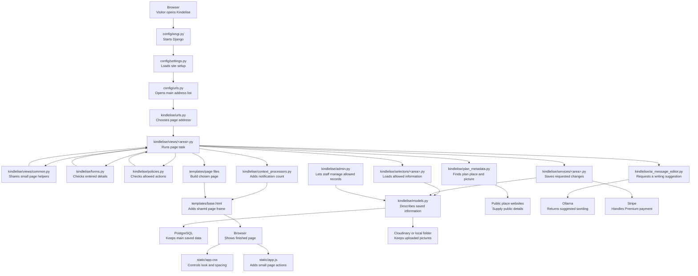

## Starting the live website

Heroku updates the database first and then starts the website. Django loads the
live settings and connects to the database, stylesheets and picture storage.

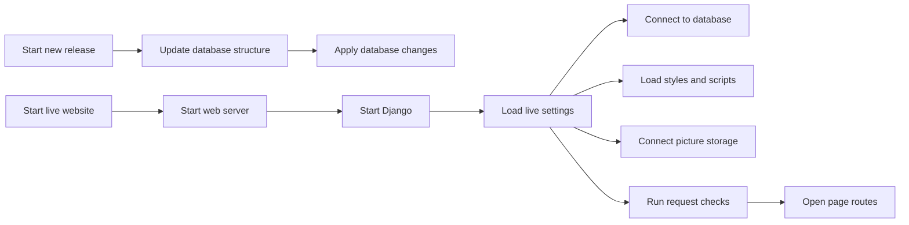

## Opening a page

When you open a page, Kindelise finds the right page code, checks what you are
allowed to do, loads or saves the required information and returns the result.

```mermaid
flowchart LR
  A["You open a page"] --> B["Web server receives request"]
  B --> C["Django starts request"]
  C --> D["Run security checks"]
  D --> E["Find main route"]
  E --> F["Find Kindelise page"]
  F --> G["Run page code"]
  G --> H{"What is needed?"}
  H -->|Entered details| I["Check entered details"]
  H -->|Saved details| J["Load allowed details"]
  H -->|Permission| K["Check user permission"]
  I --> L["Save changes safely"]
  J --> M["Read saved information"]
  K --> M
  L --> M
  M --> N["Show page or result"]
  N --> A
  click A "templates/base.html#L1" "Open the shared browser shell"
  click B "Procfile#L1" "Open the Gunicorn process command"
  click C "config/wsgi.py#L1" "Open the WSGI application"
  click D "config/settings.py#S_environment_flag" "Open settings"
  click E "config/urls.py#L1" "Open project URL routing"
  click F "kindlelise/urls.py#L1" "Open application URL routing"
  click G "kindlelise/views/accounts.py#Shome_page" "Open a view entry point"
  click H "kindlelise/views/__init__.py#L1" "Open HTTP coordination"
  click I "kindlelise/forms.py#SProfileDetailsForm" "Open form validation"
  click J "kindlelise/selectors/accounts.py#Sget_signed_in_user_account_summary" "Open an authorised read"
  click K "kindlelise/policies.py#Scan_access_discovery_plans_and_messages" "Open an access decision"
  click L "kindlelise/services/accounts.py#Supdate_signed_in_user_profile" "Open a state-changing service"
  click M "kindlelise/models.py#SProfile" "Open the data model"
  click N "templates/base.html#L1" "Open the shared response template"
```

## Creating an account and updating your profile

Creating an account also creates its empty profile. Signing in starts the user's
session. Profile changes and staff verification are handled separately.

```mermaid
flowchart LR
  A["Send sign-up form"] --> B["Open sign-up code"]
  B --> C["Check account details"]
  C --> D["Create account and profile"]
  D --> E["Save account and profile"]
  E --> F["Show sign-in page"]
  F --> G["Check sign-in and start session"]
  G --> H["Show private profile"]
  H --> I["Send profile changes"]
  I --> J["Check profile details"]
  J --> K["Save profile changes"]
  K --> E
  L["Staff chooses verification"] --> M["Update verification status"]
  M --> E
  E --> N["Show account page"]
  click A "kindlelise/urls.py#L1" "Open the account routes"
  click B "kindlelise/views/accounts.py#Ssign_up_page" "Open registration view"
  click C "kindlelise/forms.py#SAccountSignUpForm" "Open registration validation"
  click D "kindlelise/services/accounts.py#Screate_account_and_profile" "Open atomic account creation"
  click E "kindlelise/models.py#SProfile" "Open Profile model"
  click F "kindlelise/views/accounts.py#Ssign_in_page" "Open the separate sign-in page"
  click G "kindlelise/views/accounts.py#Ssign_in_page" "Open sign-in checks and session start"
  click H "kindlelise/views/accounts.py#Saccount_page" "Open private account view"
  click I "kindlelise/views/accounts.py#Sedit_profile_page" "Open profile edit view"
  click J "kindlelise/forms.py#SProfileDetailsForm" "Open profile validation"
  click K "kindlelise/services/accounts.py#Supdate_signed_in_user_profile" "Open profile update transaction"
  click L "kindlelise/admin.py#Sverify_selected_profiles_for_discovery_plans_and_messages" "Open staff verification action"
  click M "kindlelise/admin.py#S_set_profile_verification" "Open verification state change"
  click N "templates/account.html#L1" "Open account and profile template"
```

## Finding and viewing other people

Kindelise checks the viewer first, applies the allowed filters and removes
blocked or unavailable profiles before showing any results.

```mermaid
flowchart LR
  A["Open Discover"] --> B["Run Discover page"]
  B --> C["Check verified access"]
  C --> D["Work out allowed filters"]
  D --> E["Check chosen filters"]
  E --> F["Find matching profiles"]
  F --> G["Remove blocked profiles"]
  G --> H["Show profile cards"]
  H --> I["Choose a profile"]
  I --> J["Run profile page"]
  J --> K["Check profile can be viewed"]
  K --> L["Show public profile"]
  click A "kindlelise/urls.py#L1" "Open discovery routes"
  click B "kindlelise/views/discovery.py#Sdiscovery_page" "Open discovery view"
  click C "kindlelise/policies.py#Scan_access_discovery_plans_and_messages" "Open the verification gate"
  click D "kindlelise/policies.py#Sget_allowed_discovery_areas_and_interest_limit" "Open Free and Premium limits"
  click E "kindlelise/forms.py#SDiscoveryFiltersForm" "Open filter validation"
  click F "kindlelise/selectors/discovery.py#Sget_profiles_for_discovery_grid" "Open discovery query"
  click G "kindlelise/models.py#SBlock" "Open the exclusion model"
  click H "templates/discover.html#L1" "Open discovery cards"
  click I "kindlelise/urls.py#L1" "Open public profile route"
  click J "kindlelise/views/discovery.py#Sprofile_page" "Open public profile view"
  click K "kindlelise/selectors/discovery.py#Sget_profile_page_if_viewer_is_allowed" "Open profile visibility read"
  click L "templates/account.html#L1" "Open public profile template mode"
```

## Creating a plan and finding its picture

The Fetch details button looks for a public place name and picture. Kindelise
checks the result again before saving the new plan and its picture.

```mermaid
flowchart LR
  A["Enter plan details"] --> B["Choose Fetch details"]
  B --> C["Send public URL"]
  C --> D["Check public URL"]
  D --> E["Look for place and picture"]
  E --> F["Read public page safely"]
  F --> G["Return place and preview"]
  G --> A
  A --> H["Send completed plan"]
  H --> I["Check plan details"]
  I --> J["Check fetched picture"]
  J --> K["Create available plan"]
  K --> L["Save plan and picture"]
  L --> M["Show plan page"]
  click A "templates/plan.html#L1" "Open create-plan template"
  click B "static/app.js#SrequestPlanMetadata" "Open browser metadata request"
  click C "kindlelise/views/plans.py#Srequest_plan_metadata" "Open metadata endpoint"
  click D "kindlelise/forms.py#SPlanMetadataRequestForm" "Open URL validation"
  click E "kindlelise/plan_metadata.py#Sfetch_plan_metadata" "Open metadata workflow"
  click F "kindlelise/plan_metadata.py#S_fetch_https_bytes" "Open bounded HTTPS fetch"
  click G "kindlelise/plan_metadata.py#Sfetch_plan_metadata" "Open signed response creation"
  click H "kindlelise/views/plans.py#Screate_plan_page" "Open plan creation view"
  click I "kindlelise/forms.py#SPlanDetailsForm" "Open plan validation"
  click J "kindlelise/plan_metadata.py#Sthumbnail_from_metadata_token" "Open token verification"
  click K "kindlelise/services/plans.py#Screate_available_plan" "Open plan creation service"
  click L "kindlelise/models.py#SPlan" "Open Plan model"
  click M "kindlelise/views/plans.py#Splan_detail_page" "Open plan detail view"
```

## Saving and showing profile or plan pictures

Pictures are saved on the computer during local development and in Cloudinary on
the live site. Kindelise checks access before sending any saved picture.

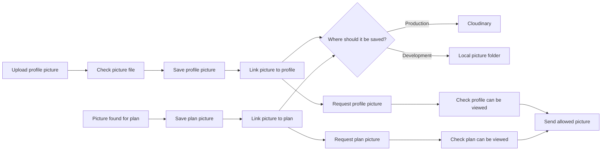

## Requesting, confirming, leaving or cancelling a plan

A request starts or reuses a direct conversation with the owner but does not
consume capacity. The owner confirms or declines it; confirmation rechecks
capacity, locks the meeting details and opens the shared plan chat. Withdrawing,
leaving and cancellation preserve the earlier participation history.

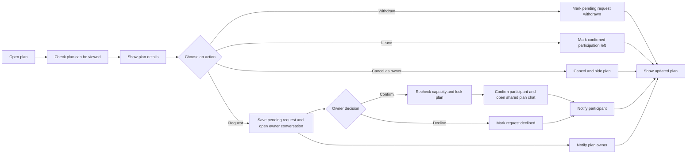

## Starting a conversation and sending a message

Kindelise creates one private conversation for the two people or reopens the
one they already have. Sending a message saves it and tells the other person.

```mermaid
flowchart LR
  A["Choose Send Message"] --> B["Start conversation"]
  B --> C["Find or create conversation"]
  C --> D["Save conversation pair"]
  D --> E["Open conversation"]
  E --> F["Check user can read messages"]
  F --> G["Show conversation"]
  G --> H["Check written message"]
  H --> I["Send message request"]
  I --> J["Save message safely"]
  J --> K["Save message"]
  J --> L["Tell recipient"]
  K --> E
  click A "templates/account.html#L1" "Open public profile message action"
  click B "kindlelise/views/messages.py#Sstart_direct_conversation" "Open conversation start endpoint"
  click C "kindlelise/services/messages.py#Sfind_or_start_direct_conversation" "Open unique pair service"
  click D "kindlelise/models.py#SConversation" "Open Conversation model"
  click E "kindlelise/views/messages.py#Sconversation_page" "Open conversation page"
  click F "kindlelise/selectors/messages.py#Sget_messages_if_user_can_open_conversation" "Open authorised message read"
  click G "templates/conversation.html#L1" "Open conversation template"
  click H "kindlelise/forms.py#SMessageDraftForm" "Open draft validation"
  click I "kindlelise/views/messages.py#Ssend_conversation_message" "Open send endpoint"
  click J "kindlelise/services/messages.py#Ssend_direct_message" "Open message transaction"
  click K "kindlelise/models.py#SMessage" "Open Message model"
  click L "kindlelise/models.py#SNotification" "Open message notification"
```

## Improving a message before sending it

The AI receives only the unsent draft and the chosen editing goal. The original
stays visible, and the user decides what to keep before pressing Send.

```mermaid
flowchart LR
  A["Choose editing goal"] --> B["Send unsent draft"]
  B --> C["Receive edit request"]
  C --> D["Check conversation access"]
  D --> E["Check draft and goal"]
  E --> F["Ask AI for suggestion"]
  F --> G["Ollama AI service"]
  G --> F
  F --> H["Return suggested draft"]
  H --> I["Show both drafts"]
  I --> J{"Choose a draft"}
  J -->|Keep original| K["Keep original text"]
  J -->|Use suggestion| L["Use suggested text"]
  K --> M["Press Send manually"]
  L --> M
  click A "templates/conversation.html#L1" "Open AI editing controls"
  click B "static/app.js#SrequestMessageDraftEditSuggestion" "Open browser request"
  click C "kindlelise/views/messages.py#Srequest_conversation_message_edit_suggestion" "Open suggestion endpoint"
  click D "kindlelise/selectors/messages.py#Sget_messages_if_user_can_open_conversation" "Open conversation access check"
  click E "kindlelise/forms.py#SMessageEditRequestForm" "Open AI request validation"
  click F "kindlelise/ai_message_editor.py#Sget_edited_message_draft_suggestion" "Open bounded Ollama client"
  click G "kindlelise/ai_message_editor.py#Sget_edited_message_draft_suggestion" "Open provider request boundary"
  click H "kindlelise/views/messages.py#Srequest_conversation_message_edit_suggestion" "Open suggestion response"
  click I "static/app.js#SshowMessageDraftEditSuggestion" "Open comparison panel logic"
  click J "static/app.js#SshowMessageDraftEditSuggestion" "Open explicit choice handling"
  click K "static/app.js#SshowMessageDraftEditSuggestion" "Open Keep original behavior"
  click L "static/app.js#SshowMessageDraftEditSuggestion" "Open Use suggestion behavior"
  click M "kindlelise/views/messages.py#Ssend_conversation_message" "Open the separate send endpoint"
```

## Seeing and clearing notifications

Direct messages, plan-chat messages and participation changes create
notifications. The top bar shows how many are unread. Opening the notifications
page lets the user mark them as read.

```mermaid
flowchart LR
  A["New direct message"] --> D["Save notification"]
  B["Participation request or decision"] --> D
  C["New plan-chat message"] --> D
  D --> E["Prepare top-bar count"]
  E --> F["Count unread items"]
  F --> G["Show number in top bar"]
  G --> H["Open notifications page"]
  H --> I["Load recent notifications"]
  I --> J["Show notification list"]
  J --> K["Choose Mark all read"]
  K --> L["Mark all as read"]
  L --> D
  click A "kindlelise/services/messages.py#Ssend_direct_message" "Open message notification creation"
  click B "kindlelise/services/plans.py#Srequest_plan_participation_and_open_owner_conversation" "Open participation notification creation"
  click C "kindlelise/services/messages.py#Ssend_plan_chat_message" "Open plan-chat notification creation"
  click D "kindlelise/models.py#SNotification" "Open Notification model"
  click E "kindlelise/context_processors.py#Snotification_badge" "Open shared context processor"
  click F "kindlelise/selectors/accounts.py#Sget_unread_notification_count" "Open unread count query"
  click G "templates/base.html#L1" "Open the notification icon"
  click H "kindlelise/views/accounts.py#Snotifications_page" "Open notifications page"
  click I "kindlelise/selectors/accounts.py#Sget_recent_notifications" "Open recent alerts query"
  click J "templates/notifications.html#L1" "Open notifications template"
  click K "kindlelise/views/accounts.py#Smark_notifications_read" "Open mark-read endpoint"
  click L "kindlelise/services/accounts.py#Smark_all_notifications_read" "Open mark-read update"
```

## Blocking someone or sending a private report

Blocking removes contact in both directions. Reporting stays available after a
block, and Kindelise checks that any attached plan or message belongs to the
people involved.

```mermaid
flowchart LR
  A["Open profile Actions"] --> B{"Choose action"}
  B -->|Block| C["Send block request"]
  C --> D["Save block safely"]
  D --> E["Save blocked pair"]
  E --> F["Remove contact and discovery"]
  B -->|Report| G["Open report page"]
  G --> H["Check reported profile"]
  H --> I["Check attached details"]
  I --> J["Check report text"]
  J --> K["Save private report"]
  K --> L["Store report"]
  L --> M["Staff can review report"]
  click A "templates/account.html#L1" "Open profile Actions section"
  click B "kindlelise/views/safety.py#L1" "Open safety endpoints"
  click C "kindlelise/views/safety.py#Sblock_profile_from_discovery_and_messages" "Open block endpoint"
  click D "kindlelise/services/safety.py#Sblock_user_from_discovery_and_messages" "Open block service"
  click E "kindlelise/models.py#SBlock" "Open Block model"
  click F "kindlelise/policies.py#Scan_start_or_continue_direct_messages" "Open block-aware messaging policy"
  click G "kindlelise/views/safety.py#Sreport_user_page" "Open report page"
  click H "kindlelise/selectors/safety.py#Sget_report_target_profile_if_reporter_is_allowed" "Open report target selector"
  click I "kindlelise/views/safety.py#S_get_private_report_context" "Open context validation"
  click J "kindlelise/forms.py#SPrivateReportForm" "Open report form validation"
  click K "kindlelise/services/safety.py#Ssubmit_private_report_about_user" "Open report service"
  click L "kindlelise/models.py#SReport" "Open Report model"
  click M "kindlelise/admin.py#SReportAdmin" "Open staff report view"
```

## Paying for and managing Premium

Payment and account management happen on Stripe. Stripe then sends a trusted
update back to Kindelise, which updates the user's Premium access.

```mermaid
flowchart LR
  A["Choose Premium action"] --> B{"Pay or manage?"}
  B -->|Pay| C["Start payment"]
  C --> D["Create Stripe payment page"]
  D --> E["Pay securely on Stripe"]
  B -->|Manage| F["Open payment settings"]
  F --> G["Create Stripe account page"]
  G --> H["Manage account on Stripe"]
  E --> I["Stripe sends payment update"]
  I --> J["Check update is genuine"]
  J --> K["Update Premium access"]
  K --> L["Save payment status"]
  L --> M["Allow extra discovery filters"]
  click A "templates/account.html#L1" "Open Premium account controls"
  click B "kindlelise/views/billing.py#L1" "Open Premium HTTP actions"
  click C "kindlelise/views/billing.py#Sstart_premium_subscription_checkout" "Open Checkout endpoint"
  click D "kindlelise/services/billing.py#Sstart_stripe_subscription_checkout" "Open Checkout service"
  click E "kindlelise/services/billing.py#Sstart_stripe_subscription_checkout" "Open Stripe Checkout boundary"
  click F "kindlelise/views/billing.py#Sopen_premium_subscription_portal" "Open portal endpoint"
  click G "kindlelise/services/billing.py#Sopen_stripe_customer_portal" "Open portal service"
  click H "kindlelise/services/billing.py#Sopen_stripe_customer_portal" "Open Stripe portal boundary"
  click I "kindlelise/urls.py#L1" "Open webhook route"
  click J "kindlelise/views/billing.py#Sreceive_and_verify_stripe_webhook" "Open signature verification"
  click K "kindlelise/services/stripe_events.py#Supdate_premium_access_from_verified_stripe_event" "Open webhook projection"
  click L "kindlelise/models.py#SStripeWebhookReceipt" "Open idempotency receipt model"
  click M "kindlelise/policies.py#Sget_allowed_discovery_areas_and_interest_limit" "Open Premium effects"
```
